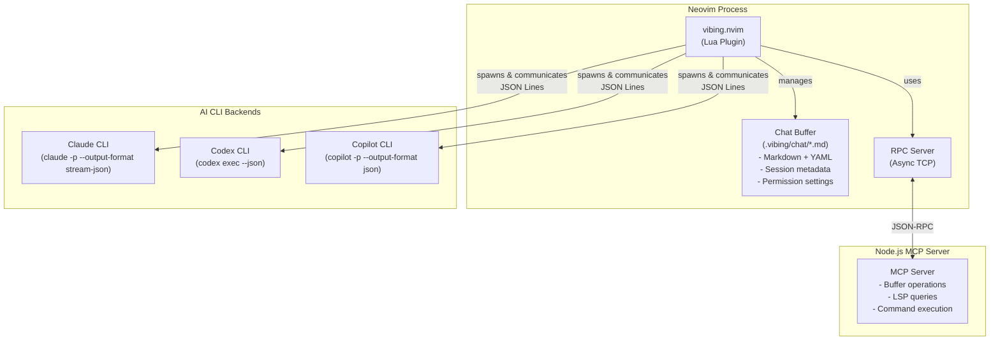

<div align="center">


# vibing.nvim

**Neovim のためのインテリジェント AI コードアシスタント**

[](https://github.com/shabaraba/vibing.nvim/actions/workflows/ci.yml)
[](https://opensource.org/licenses/MIT)
[](https://github.com/shabaraba/vibing.nvim/releases)

**Claude**・**Codex**・**GitHub Copilot** を CLI バックエンドとして統合し、コンテキストを理解した
AI チャットをエディタ内で直接利用できる Neovim プラグイン。

[English](./README.md) | 日本語

[機能](#-機能) • [インストール](#-インストール) • [使い方](#-使い方) •
[設定](#️-設定) • [コントリビュート](#-コントリビュート)

</div>

---

## 目次

- [機能](#-機能)
- [インストール](#-インストール)
- [クイックスタート](#-クイックスタート)
- [使い方](#-使い方)
- [設定](#️-設定)
- [チャットファイル形式](#-チャットファイル形式)
- [アーキテクチャ](#️-アーキテクチャ)
- [FAQ](#-faq)
- [コントリビュート](#-コントリビュート)
- [ライセンス](#-ライセンス)
- [リンク](#-リンク)

## ✨ 機能

静的なコンテキストを LLM に送るだけのチャットプラグインと異なり、vibing.nvim は
CLI バックエンドと MCP 統合を通じて、AI に**実行中の Neovim インスタンスへの直接アクセス**を
提供します。

- **🤖 Neovim をエージェントのツールに** — MCP 経由で AI がバッファの読み書き、コマンド実行、
  LSP クエリ(診断・定義・参照・シンボル)を*実行中の*エディタに対して行える
- **🔀 マルチバックエンド** — Claude CLI(`claude -p --output-format stream-json`)、
  Codex CLI(`codex exec --json`)、GitHub Copilot CLI(`copilot -p --output-format json`)、
  Grok Build CLI(`grok --single --output-format streaming-json`)。
  `adapter` 設定でグローバルに、チャットごとには frontmatter の `agent` フィールドで切り替え
- **💾 ファイルベースのセッション永続化** — チャットは `.vibing/chat/` 配下の YAML frontmatter
  付き Markdown ファイル。持ち運び可能・再開可能(CLI セッション状態を完全復元)・監査可能・
  バージョン管理可能
- **🔀 並行セッション** — 複数の独立したチャットを同時実行。あるチャットの処理中でも新しい
  チャットを開始できる
- **🛡️ きめ細かい権限制御** — ツールごとの allow/deny/ask リスト、機密ファイル向けの
  パスベースルール、Bash コマンドパターン、対話的な Permission Builder UI
- **📊 diff ビューア** — 変更ファイル上で `gd` を押すと before/after の diff を表示。
  ターンごとにワーキングツリーを git ツリーオブジェクトとしてスナップショットするので、
  Bash 経由の `sed -i` / `mv` / フォーマッタ実行も `Edit` と同じように追跡される。
  外部ツールもセットアップも不要で、ユーザーの index には触らない
- **🎯 スマートコンテキスト** — 手動追加、oil.nvim、ビジュアル選択からファイルをコンテキストへ
- **🌍 多言語対応** — AI 応答の言語をチャットごとに設定可能

### 他の選択肢を検討すべきケース

- ローカル/オフラインモデル(Ollama 等)が必要
- 最小限の依存関係を好む(vibing.nvim は MCP サーバーのため Node.js が必要)
- 大きなコミュニティを持つ実績あるプラグインが欲しい(私たちはまだ成長中です!)

vibing.nvim は補完プラグイン(Copilot、Codeium)や他のチャットプラグインと競合しません。

## 📦 インストール

### 前提条件

- **Neovim** 0.10+(`vim.system()` を使用)
- **Node.js** 18+(MCP サーバー用)
- AI CLI バックエンドを最低1つ:
  - **Claude CLI**(`claude`)— `npm install -g @anthropic-ai/claude-code`
  - **Codex CLI**(`codex`)— `npm install -g @openai/codex`(**0.140+**。下の注記を参照)
  - **GitHub Copilot CLI**(`copilot`)— `npm install -g @github/copilot`
  - **Grok Build CLI**(`grok`)— [xAI のインストール手順](https://github.com/xai-org/grok-cli)を参照
    (Node.js 22+ が必要。MCP サーバー自体の要件 18+ より高い)

> **Codex のバージョンについて。** vibing.nvim は Codex バックエンドの軽量呼び出し(チャットタイトル
> 生成・`/summarize`・デイリーサマリー)を `--ignore-user-config --strict-config` 付きで実行します。
> これによりユーザーの MCP サーバーに到達させず、また Codex 側が設定キーをリネームした際に「気づかない
> まま制限が外れる」のではなく明示的に失敗するようにしています。両フラグは **0.140.0 と 0.147.0** で、
> `codex exec` / `codex exec resume` の双方に存在することを確認済みです。それより古いバージョンは未検証
> で、フラグが無い場合は通常のチャットには影響しませんが、軽量呼び出しが unknown argument エラーで
> 失敗します。その場合は Codex を更新してください。
>
> `--ignore-user-config` は `model_provider` も落とします。`config.toml` でカスタムプロバイダや
> ローカルプロバイダを指定している場合、**軽量呼び出しだけが既定の OpenAI エンドポイントに向きます**
> (通常のチャットは指定どおりのプロバイダを使います)。該当する場合は Neovim セッションごとに一度だけ
> 警告します。プロバイダの判定は Codex 自身 (`codex doctor --json`) に問い合わせており、Codex が
> 答えられなかったときは何も表示しません。`agent.codex_provider_notice.enabled = false` で警告と
> probe をまとめて止められます。

### [lazy.nvim](https://github.com/folke/lazy.nvim) を使う場合

```lua
{
  "shabaraba/vibing.nvim",
  dependencies = {
    "stevearc/oil.nvim",  -- オプション: ファイルブラウザ統合
  },
  build = "./build.sh",  -- 同梱 MCP サーバーのビルド
  config = function()
    require("vibing").setup()
  end,
}
```

`setup()` に渡せるオプションは[設定](#️-設定)を参照してください。

### [packer.nvim](https://github.com/wbthomason/packer.nvim) を使う場合

```lua
use {
  "shabaraba/vibing.nvim",
  run = "./build.sh",
  config = function()
    require("vibing").setup()
  end,
}
```

### Claude Code プラグイン(MCP + スキル + エージェント)

vibing.nvim は [Claude Code プラグイン](https://code.claude.com/docs/en/plugins)を同梱して
おり、`vibing-nvim` MCP サーバー・Neovim 対応スキル・読み取り専用ナビゲーション
サブエージェントが含まれます。

**インストール作業はありません。** このプラグインは Claude Code のグローバル状態には一切
登録されません。vibing.nvim が自分の `claude-plugin/` ディレクトリをセッションごとに
`--plugin-dir` で CLI に渡すため、いま動いている checkout がそのまま使われます(worktree を
含む)。`build.sh` がやるのは MCP サーバーのビルドと、旧バージョンのインストールが残っている
場合の一度きりの後片付けだけです。

これにより `mcp__plugin_vibing-nvim_vibing-nvim__*` ツール(実行中の Neovim へのバッファ/
ウィンドウ/カーソルアクセス・Ex コマンド・LSP クエリ)、同梱スキル(`nvim-context`、
`nvim-lsp-navigation`、`vibing-chat-recall`、`vibing-chat-search`、および worktree
ワークフローの `vibing-worktree-{list,create,attach,run,finish}`)、`nvim-navigator`
サブエージェント(`@vibing-nvim:nvim-navigator` による読み取り専用コードナビゲーション)が
利用できます。

MCP ツールの接続先として、`mcp = { enabled = true }`(デフォルト)の Neovim が起動している
必要があります。引き換えに、Neovim の外で起動した素の `claude` セッションからはこれらの
ツールが見えなくなります。もともと想定された使い方ではありません。

**プロジェクト固有のプラグイン。** `.vibing/plugins/<name>/`(`.claude-plugin/plugin.json`
付き)に置いたものは同じ仕組みで読み込まれ、そのプロジェクトのチャットにだけ効きます。追加
したら `:VibingReloadCommands` を実行してください。雛形は `:VibingCreatePlugin <name>` で作れます。なお、プラグインは `mcpServers` を宣言
できるため、クローンしたリポジトリに仕込まれたプラグインが手元でプロセスを起動しうる点には
注意してください。信用できないリポジトリでは `agent.plugins.project_dir = false` にします。
`agent.plugins` の詳細は [handbook/configuration.md](handbook/configuration.md) を参照。

**旧バージョンからの移行:** `build.sh` が user scope のインストールとマーケットプレイス
登録を削除します。手動でやる場合:

```text
/plugin uninstall vibing-nvim@vibing
/plugin marketplace remove vibing
```

## 🚀 クイックスタート

```vim
:VibingChat        " 新しいチャットを開く
```

`## User` ヘッダの下にメッセージを書き、ノーマルモードで `<CR>` を押すと送信されます。
AI は同じバッファ内に応答します。`<C-c>` で実行中のリクエストをキャンセルできます。
チャットは通常の Markdown バッファなので、他のファイルと同様に保存・検索・編集できます。

## 🚀 使い方

### ユーザーコマンド

| コマンド                              | 説明                                                                                               |
| ------------------------------------- | -------------------------------------------------------------------------------------------------- |
| `:VibingChat [position\|file]`        | 新規チャット作成。位置指定(current\|right\|left\|top\|bottom\|back)または保存済みファイルを開く    |
| `:VibingToggleChat`                   | 既存チャットウィンドウの表示切り替え(会話を保持)                                                   |
| `:VibingChatFork [position]`          | 現在のチャットをフォーク(会話を分岐)                                                               |
| `:VibingSlashCommands`                | スラッシュコマンドピッカーを表示                                                                   |
| `:VibingSetFileTitle`                 | AI がタイトルを生成しチャットファイルをリネーム                                                    |
| `:VibingSummarize [--with-title]`     | チャット履歴の AI 要約を生成してバッファに挿入(--with-title で続けて要約からリネーム)              |
| `:VibingDeleteChats [--unrenamed]`    | チャットファイルを削除(--unrenamed で未リネームのファイルを一括削除)                               |
| `:VibingContext [path]`               | コンテキスト追加: oil.nvim のエントリ、ビジュアル選択(range)、パス引数、引数なしなら現在のバッファ |
| `:VibingClearContext`                 | コンテキストを全クリア                                                                             |
| `:VibingCancel`                       | 実行中のリクエストをキャンセル                                                                     |
| `:VibingReloadCommands`               | カスタムスラッシュコマンドと補完候補を再読み込み                                                   |
| `:VibingCreatePlugin [name]`          | `.vibing/plugins/` にプロジェクト固有のClaude Codeプラグインを作成                                 |
| `:VibingCopyUnsentUserHeader`         | `## User <!-- unsent -->` をクリップボードにコピー                                                 |
| `:VibingDailySummary [YYYY-MM-DD]`    | プロジェクトのチャットから日報を生成(デフォルト: 今日)                                             |
| `:VibingDailySummaryAll [YYYY-MM-DD]` | すべてのチャットから日報を生成(デフォルト: 今日)                                                   |

**コマンドの補足:**

- **`:VibingChat`** — 常に新規チャットを作成。位置
  (`current` / `right` / `left` / `top` / `bottom` / `back`)または保存済みチャットファイルの
  パスを指定できます。
- **`:VibingChatFork`** — 現在の会話をフォークして別方向に分岐(同じ位置指定を受け付けます)。
- **`:VibingToggleChat`** — 現在の会話の表示/非表示を切り替え(状態は保持)。
- **worktree のライフサイクル** — 同梱の
  `vibing-worktree-{list,create,attach,run,finish}` Claude Code スキルが自然言語
  (「worktree に切り出して」など)で処理します。エディタコマンドはありません。

### スラッシュコマンド(チャット内)

| コマンド                  | 説明                                                                       |
| ------------------------- | -------------------------------------------------------------------------- |
| `/context <file>`         | ファイルをコンテキストに追加                                               |
| `/clear`                  | コンテキストをクリア                                                       |
| `/save`                   | 現在のチャットを保存                                                       |
| `/summarize`              | 会話を要約                                                                 |
| `/model <model>`          | AI モデルを設定(haiku/sonnet/opus/fable)                                   |
| `/effort <level>`         | 推論量を設定(low/medium/high/xhigh/max)                                    |
| `/help`                   | 利用可能なスラッシュコマンドを表示                                         |
| `/permissions` or `/perm` | 対話的 Permission Builder — ツールの allow/deny ルールを設定               |
| `/allow [tool]`           | allow リストに追加(`-tool` で削除)。引数なしで現在のリストを表示           |
| `/deny [tool]`            | deny リストに追加(`-tool` で削除)。引数なしで現在のリストを表示            |
| `/ask [tool]`             | 使用前に確認するツールを追加(`-tool` で削除)。引数なしで現在のリストを表示 |
| `/permission [mode]`      | 権限モードを設定(default/acceptEdits/bypassPermissions/plan/dontAsk/auto)  |
| `/new-session`            | セッションをリセットして新規開始                                           |

`/allow`・`/deny`・`/ask` は `Bash(git:*)`、`Read(src/**/*.ts)`、`WebFetch(github.com)` の
ような粒度指定パターンも受け付けます。

### チャットのキーバインド

チャットバッファでは以下のキーバインドが使えます(`q` 以外は `keymaps` 設定で変更可能 —
[設定](#️-設定)参照):

| キー    | 説明                                                                      |
| ------- | ------------------------------------------------------------------------- |
| `<CR>`  | メッセージ送信(ノーマルモード)                                            |
| `<C-c>` | 実行中のリクエストをキャンセル                                            |
| `<C-a>` | ファイルをコンテキストに追加                                              |
| `gd`    | カーソル下のファイルの diff 表示(Modified Files セクション内)             |
| `gf`    | カーソル下のファイルを開く(Modified Files セクションほかチャット内のパス) |
| `gx`    | カーソル行の URL をブラウザで開く                                         |
| `q`     | チャットウィンドウを閉じる                                                |

## ⚙️ 設定

`require("vibing").setup()` はそのままで動作します。よく変更されるオプション:

```lua
require("vibing").setup({
  adapter = "claude",              -- "claude" | "codex" | "copilot"
  chat = {
    window = {
      position = "current",        -- "current" | "right" | "left" | "top" | "bottom" | "back" | "float"
      width = 0.4,                 -- 画面幅に対する比率(0-1)
    },
    save_location_type = "project", -- "project" | "user" | "custom"
  },
  agent = {
    default_model = "sonnet",      -- "sonnet" | "opus" | "haiku" | "fable"
  },
  permissions = {
    mode = "acceptEdits",          -- "default" | "acceptEdits" | "plan" | "auto" | "dontAsk" | "bypassPermissions"
    allow = { "Read", "Edit", "Write", "Glob", "Grep", "Skill", "StructuredOutput" },
    deny = { "Bash" },
  },
  language = nil,                  -- 例: "ja"、または { default = "ja", chat = "ja" }
})
```

上記のデフォルト権限は、新規チャットファイル作成時の**テンプレート**として使われます。実行時に
適用されるのは各チャットファイルの frontmatter に記録された権限です。

**完全なリファレンス:** すべてのオプション(ウィンドウ詳細、UI/グラデーション/ツールマーカー、
diff バックエンド、粒度の細かい権限ルール、MCP、Node.js 実行ファイル、日報など)は
[handbook/configuration.md](./handbook/configuration.md)(英語)を参照してください。

## 📝 チャットファイル形式

チャットは YAML frontmatter 付きの Markdown ファイル(デフォルトで
`.vibing/chat/chat-<timestamp>-....md`)として保存され、セッション再開と設定の記録に
使われます:

```yaml
---
vibing.nvim: true
session_id: <cli-session-id>
created_at: 2024-01-01T12:00:00
working_dir: .vibing/worktrees/feature-x  # オプション: 作業ディレクトリ(git ルートからの相対パス)
agent: claude  # claude | codex | copilot(このチャットに限りグローバルの adapter 設定を上書き)
mode: code  # code | plan | explore
model: sonnet  # sonnet | opus | haiku | fable
permission_mode: acceptEdits  # default | acceptEdits | bypassPermissions | plan | dontAsk | auto
permissions_allow:
  - Read
  - Edit
  - Write
  - Glob
  - Grep
permissions_deny:
  - Bash
permissions_ask: []
language: ja  # オプション: AI 応答のデフォルト言語
---
# Vibing Chat

## User

Hello, Claude!

## Assistant

Hello! How can I help you today?
```

**ポイント:**

- **セッション再開** — 保存済みチャットを開き直すと `session_id` で会話を再開
- **フォーク追跡** — フォークされたチャットは最初の応答まで `forked_from` フィールドを保持
- **監査可能性** — モデル・モード・権限がすべて frontmatter で確認できる
- **言語サポート** — オプションの `language` フィールドで AI 応答言語を固定

## 🏗️ アーキテクチャ

詳細なアーキテクチャドキュメントは [CLAUDE.md](./CLAUDE.md) を参照してください。



| 観点             | 従来の REST API     | vibing.nvim(CLI アダプター)    |
| ---------------- | ------------------- | ------------------------------ |
| コンテキスト     | 手動で組み立て      | MCP: エージェントが随時要求    |
| エディタアクセス | なし(fire & forget) | MCP による完全な双方向アクセス |
| セッション状態   | プラグインが管理    | CLI セッションを resume        |
| ツール実行       | プラグインが実装    | CLI ネイティブツール           |

## ❓ FAQ

### どの AI バックエンドに対応していますか?

- **Claude CLI**(`claude -p --output-format stream-json`)— Claude Code のフル機能
- **Codex CLI**(`codex exec --json`)— OpenAI Codex バックエンド
- **GitHub Copilot CLI**(`copilot -p --output-format json`)— GitHub Copilot バックエンド
- **Grok Build CLI**(`grok --single --output-format streaming-json`)— xAI Grok バックエンド

setup の `adapter = "claude"|"codex"|"copilot"` でグローバルに、チャットファイルの frontmatter に
`agent: claude` / `agent: codex` / `agent: copilot` を書けばチャット単位で切り替えられます。

> **注意:** Copilot バックエンドでは、`permissions.mode`・`permissions.ask`・チャット内のツール
> 承認 UI を、vibing.nvim が生成する Copilot プラグイン(`.vibing/copilot-plugin/`)経由で適用
> します。これは実行ごとに `copilot --plugin-dir` で読み込まれるもので、ユーザーの
> `~/.copilot/` の設定・ログイン情報には一切触れません。Copilot の静的な `--deny-tool` フラグも
> 引き続きバックストップとして渡します。対応するのは `Bash`(`Bash(cmd:*)` 形式を含む)・
> `Write`・`Edit`・`WebFetch`・`WebSearch` で、Copilot 側に権限パターンが無いツール名を落とす
> 際は一度だけ警告を出します。

### なぜ Node.js が必要なのですか?

MCP サーバーに必要です。MCP サーバーは実行中の Neovim インスタンスへの直接アクセス
(バッファ読み書き・LSP クエリ・コマンド実行)を AI に提供します。AI CLI バイナリ
(`claude`、`codex`、`copilot`)自体は別途インストールします。

### Claude Code CLI と比べてどうですか?

vibing.nvim は Claude Code CLI と同等の機能を Neovim に統合したものです:

- 内部では同じ `claude` CLI を使用
- MCP でエディタを制御(CLI はターミナルを、vibing は Neovim を制御)
- Anthropic 以外のワークフロー向けに Codex / GitHub Copilot バックエンドも選択可能

「Neovim ユーザーのための Claude Code(または Codex、Copilot)」と考えてください。

### 他の AI プラグインと併用できますか?

はい。vibing.nvim は補完プラグイン(Copilot、Codeium)や他のチャットプラグインと競合しません。
深い対話には vibing.nvim を、素早い補完や別プロバイダーには他のツールを使い分けられます。

## 🤝 コントリビュート

コントリビューションを歓迎します! [CONTRIBUTING.md](./CONTRIBUTING.md) を参照の上、
Issue や Pull Request をお気軽にどうぞ。

## 📄 ライセンス

MIT License — 詳細は LICENSE ファイルを参照してください。

## 🔗 リンク

- [Claude AI](https://claude.ai)
- [Codex CLI](https://github.com/openai/codex)
- [GitHub Copilot CLI](https://github.com/github/copilot-cli)
- [Grok CLI](https://github.com/xai-org/grok-cli)
- [GitHub リポジトリ](https://github.com/shabaraba/vibing.nvim)

---

Made with ❤️ using Claude Code!
