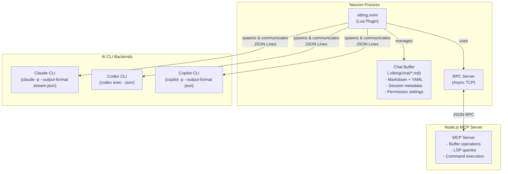

<div align="center">


# vibing.nvim

**Claude・Codex・Copilot・Grok を Neovim のバッファに。エディタごと彼らに渡す**

[](https://github.com/shabaraba/vibing.nvim/actions/workflows/ci.yml)
[](https://opensource.org/licenses/MIT)
[](https://github.com/shabaraba/vibing.nvim/releases)
[](https://neovim.io)

[English](./README.md) | 日本語

[デモ](#-デモ) • [機能](#-機能) • [必要環境](#-必要環境) •
[インストール](#-インストール) • [設定](#️-設定) • [使い方](#-使い方)

</div>

<!-- デモは GitHub の添付 URL。プレイヤーとして描画されるには裸の URL のままである必要がある -->
<!-- markdownlint-disable MD034 -->

https://github.com/user-attachments/assets/6deaaf7a-e94c-4b11-9144-011ce3a785a6

<sub>数秒で3枚のチャットを開き、3つの別々の問いを同時に走らせているところ。すべて1つの Neovim
の中。</sub>

## ✨ 機能

静的なコンテキストを LLM に送るだけのチャットプラグインと違い、vibing.nvim は CLI バックエンドと
MCP を通じて、AI に**実行中の Neovim への直接アクセス**を渡します。

- 🤖 **Neovim をエージェントのツールに** — バッファの読み書き、Ex コマンド実行、実行中の LSP への
  問い合わせ(診断・定義・参照・シンボル)
- 💬 **チャットは Markdown バッファ** — 自分のキーマップ・モーション・検索がそのまま効く。
  `.vibing/chat/` に保存され、再開でき、grep でき、バージョン管理できる
- 🔀 **マルチバックエンド** — Claude・Codex・GitHub Copilot・Grok を全体またはチャット単位で切替
- 🧵 **並行チャット** — 何枚でも開ける。別のチャットがストリーミング中でも新しく始められる
- 🪟 **マルチエージェント** — 1つのチャットが worker チャットを作って動かし、報告を集約する
- 🌱 **git worktree ワークフロー** — 頼むだけで `.vibing/worktrees/<branch>/` に作業を隔離
- 📊 **ターンごとの diff** — ターンの末尾に `### Modified Files`、`gd` でパッチビューア。基準は
  git ツリースナップショットなので、Bash 経由の `sed -i` も `Edit` と同じように追跡される
- 🛡️ **きめ細かい権限制御** — ツール・パス・コマンドパターン単位の allow/deny/ask を、ターンを
  殺さずバッファ上で答えられる
- ⏳ **使用量上限のスケジューリング** — 上限中の `<CR>` は失敗確定のリクエストを投げず、解除後に
  そのまま送る
- 🌍 **チャットごとの応答言語**

### 他の選択肢を検討すべきケース

- ローカル/オフラインモデル(Ollama 等)が必要
- 最小限の依存関係を好む — vibing.nvim は MCP サーバーのため Node.js が必要
- 大きなコミュニティを持つ実績あるプラグインが欲しい(私たちはまだ成長中です!)

vibing.nvim は補完プラグイン(Copilot、Codeium)や他のチャットプラグインと競合しません。

## 🎥 デモ

すべて実際の CLI を相手に録った未編集のセッションです。プラグインも設定も配布時のまま、モックは
ありません。

### 1ターンは必ず読める diff で終わる

ターンの末尾に `### Modified Files` が出ます。ファイル名の上で `gd` を押すと3ペインのパッチ
ビューアが開き、ターン開始時点のツリーと現在が並びます。

https://github.com/user-attachments/assets/5ab1745a-e12c-4a75-b1c6-48bdd7c14053

### 承認はポップアップではなくバッファで答える

ツールが許可を必要とすると、選択肢がチャットに書き込まれます。要らない行を消して `<CR>`。
答えを待つ間フックがブロックするので、**ターンは中断・再実行ではなくそのまま再開します** —
モデルはそれまでに積み上げた内容を全部保ったままです。

https://github.com/user-attachments/assets/9119e216-2970-41f6-bfba-615f4585bf28

### モデルから質問を投げて、答えを待てる

選択肢が未送信セクションに描画されます。その下に答えを書いて `<CR>` を押すと、それがツールの
戻り値としてそのまま返り、同じターンが続きます。

https://github.com/user-attachments/assets/7015c274-9d6b-4329-9a67-e9379f679b50

### 1つのチャットが他のチャットを作って動かせる

並行作業を頼むと、そのチャットがオーケストレーターになります。タスクごとの worker チャットは
それぞれ独自のトランスクリプトを持ち、作業中に開いて覗けます。`## Request` と `## Report` に、
どのチャットがどのチャットに何を言ったかが残ります。

https://github.com/user-attachments/assets/0d6dfa6e-8b82-49a0-b996-1c22332276cd

<sub>3倍速で再生しています。</sub>

### 危ない作業は git worktree の中へ

「これは worktree を切ってやって」と言うだけです。`.vibing/worktrees/<branch>/` にブランチが
切られ、編集もテスト実行もコミットも全部その中で起きます。いま見ているチェックアウトは一切
動きません — 左ウィンドウのファイルが最後まで変わらないのがそれです。

https://github.com/user-attachments/assets/9810e4fa-4765-4d39-bbac-2a81cd3e0a8e

### 説明するのではなく、エディタを動かす

コードの流れを案内してほしいと頼むと、本物のツアーになります。quickfix にルート全体が入り
(あとから `:cnext` で歩き直せます)、各ステップで実際のファイルが実際の行で開き、説明はその場に
仮想テキストの注釈として残ります。

https://github.com/user-attachments/assets/8182307e-83f6-428a-af11-1122b69f4483

<sub>3倍速で再生しています。</sub>

<!-- markdownlint-enable MD034 -->

## 📋 必要環境

- [Neovim](https://neovim.io) **0.10+**(`vim.system()` を使用)
- [Node.js](https://nodejs.org) **18+** — 同梱の MCP サーバー用
- C コンパイラ — 任意。無い場合はチャット用 Tree-sitter パーサーのビルドを省略し、従来の
  バッファ全体 Markdown 解析にフォールバックします
- AI CLI バックエンドを最低1つ:

| バックエンド       | インストール                                                  |
| ------------------ | ------------------------------------------------------------- |
| Claude CLI         | `npm install -g @anthropic-ai/claude-code`                    |
| Codex CLI          | `npm install -g @openai/codex`(**0.140+**)                    |
| GitHub Copilot CLI | `npm install -g @github/copilot`(Node.js 22+ が必要)          |
| Grok Build CLI     | [xAI のインストール手順](https://github.com/xai-org/grok-cli) |

<details>
<summary><b>Codex のバージョンについて</b></summary>

vibing.nvim は Codex バックエンドの軽量呼び出し(チャットタイトル生成・`/summarize`・デイリー
サマリー)を `--ignore-user-config --strict-config` 付きで実行します。これによりユーザーの MCP
サーバーに到達させず、また Codex 側が設定キーをリネームした際に「気づかないまま制限が外れる」
のではなく明示的に失敗するようにしています。両フラグは **0.140.0 と 0.147.0** で、`codex exec` /
`codex exec resume` の双方に存在することを確認済みです。それより古いバージョンは未検証で、
フラグが無い場合は通常のチャットには影響しませんが、軽量呼び出しが unknown argument エラーで
失敗します。その場合は Codex を更新してください。

`--ignore-user-config` は `model_provider` も落とします。`config.toml` でカスタムプロバイダや
ローカルプロバイダを指定している場合、**軽量呼び出しだけが既定の OpenAI エンドポイントに
向きます**(通常のチャットは指定どおりのプロバイダを使います)。該当する場合は Neovim セッション
ごとに一度だけ警告します。プロバイダの判定は Codex 自身(`codex doctor --json`)に問い合わせて
おり、Codex が答えられなかったときは何も表示しません。
`agent.codex_provider_notice.enabled = false` で警告と probe をまとめて止められます。

</details>

## 📦 インストール

[lazy.nvim](https://github.com/folke/lazy.nvim) の場合:

```lua
{
  "shabaraba/vibing.nvim",
  build = "./build.sh", -- チャット用パーサーと同梱 MCP サーバーのビルド
  dependencies = {
    "stevearc/oil.nvim", -- 任意: ファイルブラウザから直接コンテキスト追加
  },
  opts = {},
}
```

`opts` はそのまま `require("vibing").setup()` に渡されます。

<details>
<summary><b>packer.nvim</b></summary>

```lua
use {
  "shabaraba/vibing.nvim",
  run = "./build.sh",
  config = function()
    require("vibing").setup()
  end,
}
```

</details>

<details>
<summary><b>同梱の Claude Code プラグイン(MCP + スキル + サブエージェント)</b></summary>

vibing.nvim は [Claude Code プラグイン](https://code.claude.com/docs/en/plugins)を同梱して
おり、`vibing-nvim` MCP サーバー・Neovim 対応スキル・読み取り専用ナビゲーションサブエージェント
が含まれます。

**インストール作業はありません。** このプラグインは Claude Code のグローバル状態には一切
登録されません。vibing.nvim が自分の `claude-plugin/` ディレクトリをセッションごとに
`--plugin-dir` で CLI に渡すため、いま動いている checkout がそのまま使われます(worktree を
含む)。`build.sh` は MCP サーバーに加え、チャット境界を扱う小さな Tree-sitter パーサーを
ビルドします。また、旧バージョンのインストールが残っている場合は一度だけ後片付けします。

これにより `mcp__plugin_vibing-nvim_vibing-nvim__*` ツール(実行中の Neovim へのバッファ/
ウィンドウ/カーソルアクセス・Ex コマンド・LSP クエリ)、同梱スキル(`nvim-context`、
`nvim-lsp-navigation`、`vibing-chat-recall`、`vibing-chat-search`、および worktree
ワークフローの `vibing-worktree-{list,create,attach,run,finish}`)、`nvim-navigator`
サブエージェント(`@vibing-nvim:nvim-navigator` による読み取り専用コードナビゲーション)が
利用できます。

MCP ツールの接続先として、`mcp = { enabled = true }`(デフォルト)の Neovim が起動している
必要があります。引き換えに、Neovim の外で起動した素の `claude` セッションからはこれらの
ツールが見えなくなります。もともと想定された使い方ではありません。

Codex バックエンドは `--plugin-dir` を使わず同じものを読み込みます。MCP サーバーは実行ごとに
`-c mcp_servers.vibing-nvim.*` で登録され(ツール名は `mcp__vibing-nvim__*`)、スキルは
`developer_instructions` としてモデルに提示されます。サブエージェントは引き継がれません。

**プロジェクト固有のプラグイン。** `.vibing/plugins/<name>/`(`.claude-plugin/plugin.json`
付き)に置いたものは同じ仕組みで読み込まれ、そのプロジェクトのチャットにだけ効きます。追加
したら `:VibingReloadCommands` を実行してください。雛形は `:VibingCreatePlugin <name>` で
作れます。なお、プラグインは `mcpServers` を宣言できるため、クローンしたリポジトリに仕込まれた
プラグインが手元でプロセスを起動しうる点には注意してください。信用できないリポジトリでは
`agent.plugins.project_dir = false` にします。`agent.plugins` の詳細は
[handbook/configuration.md](handbook/configuration.md) を参照。

**旧バージョンからの移行:** `build.sh` が user scope のインストールとマーケットプレイス
登録を削除します。手動でやる場合:

```text
/plugin uninstall vibing-nvim@vibing
/plugin marketplace remove vibing
```

</details>

## 🚀 クイックスタート

```vim
:VibingChat
```

`## User` ヘッダの下にメッセージを書き、ノーマルモードで `<CR>` を押すと送信されます。AI は同じ
バッファ内に応答し、`<C-c>` で実行中のリクエストをキャンセルできます。チャットは通常の Markdown
ファイルとして保存・検索・編集できます。小さな `vibing` Tree-sitter パーサーがチャットヘッダと
ツール出力を分離し、各メッセージ本文に標準の Markdown パーサーを注入するため、フェンス内の言語を
含む既存のハイライトは維持されます。

## ⚙️ 設定

`require("vibing").setup()` はそのままで動作します。よく変更されるオプション:

```lua
require("vibing").setup({
  adapter = "claude",              -- "claude" | "codex" | "copilot" | "grok"
  chat = {
    window = {
      position = "current",        -- "current" | "right" | "left" | "top" | "bottom" | "back" | "float"
      width = 0.4,                 -- 画面幅に対する比率(0-1)
    },
    save_location_type = "project", -- "project" | "user" | "custom"
  },
  agent = {
    default_model = "sonnet",      -- backend のモデルID。例: "sonnet" / "gpt-5.6-terra"
    default_effort = "default",     -- "default" | "low" | "medium" | "high" | "xhigh" | "max"
  },
  permissions = {
    mode = "acceptEdits",          -- "default" | "acceptEdits" | "plan" | "auto" | "dontAsk" | "bypassPermissions"
    allow = { "Read", "Edit", "Write", "Glob", "Grep", "Skill", "StructuredOutput" },
    deny = { "Bash" },
  },
  language = nil,                  -- 例: "ja"、または { default = "ja", chat = "ja" }
})
```

上記のデフォルト権限は、新規チャットファイル作成時の**テンプレート**として使われます。実行時に
適用されるのは各チャットファイルの frontmatter に記録された権限です。

**完全なリファレンス:** すべてのオプション(ウィンドウ詳細、UI/グラデーション/ツールマーカー、
diff バックエンド、粒度の細かい権限ルール、MCP、Node.js 実行ファイル、日報など)は
[handbook/configuration.md](./handbook/configuration.md)(英語)を参照してください。

## 🚀 使い方

### ユーザーコマンド

| コマンド                                     | 説明                                                                                                                                  |
| -------------------------------------------- | ------------------------------------------------------------------------------------------------------------------------------------- |
| `:VibingChat [position\|file]`               | 新規チャット作成。位置指定(current\|right\|left\|top\|bottom\|back)または保存済みファイルを開く                                       |
| `:VibingToggleChat`                          | 既存チャットウィンドウの表示切り替え(会話を保持)                                                                                      |
| `:VibingChatFork [position]`                 | 現在のチャットをフォーク(会話を分岐)                                                                                                  |
| `:VibingSlashCommands`                       | スラッシュコマンドピッカーを表示                                                                                                      |
| `:VibingSetFileTitle [--linked]`             | AI がタイトルを生成しチャットファイルをリネーム(--linked でリンク先のチャットも同様に処理)                                            |
| `:VibingSummarize [--with-title] [--linked]` | チャット履歴の AI 要約を生成してバッファに挿入(--with-title で続けて要約からリネーム、--linked で frontmatter のリンク先にも同じ処理) |
| `:VibingDeleteChats [--unrenamed]`           | チャットファイルを削除(--unrenamed で未リネームのファイルを一括削除)                                                                  |
| `:VibingContext [path]`                      | コンテキスト追加: oil.nvim のエントリ、ビジュアル選択(range)、パス引数、引数なしなら現在のバッファ                                    |
| `:VibingClearContext`                        | コンテキストを全クリア                                                                                                                |
| `:VibingCancel`                              | 実行中のリクエストをキャンセル                                                                                                        |
| `:VibingReloadCommands`                      | カスタムスラッシュコマンドと補完候補を再読み込み                                                                                      |
| `:VibingCreatePlugin [name]`                 | `.vibing/plugins/` にプロジェクト固有のClaude Codeプラグインを作成                                                                    |
| `:VibingCopyUnsentUserHeader`                | `## User <!-- unsent -->` をクリップボードにコピー                                                                                    |
| `:VibingDailySummary [YYYY-MM-DD]`           | プロジェクトのチャットから日報を生成(デフォルト: 今日)                                                                                |
| `:VibingDailySummaryAll [YYYY-MM-DD]`        | すべてのチャットから日報を生成(デフォルト: 今日)                                                                                      |

- **`:VibingChat`** — 常に新規チャットを作成。位置
  (`current` / `right` / `left` / `top` / `bottom` / `back`)または保存済みチャットファイルの
  パスを指定できます。
- **`:VibingChatFork`** — 現在の会話をフォークして別方向に分岐(同じ位置指定を受け付けます)。
- **`:VibingToggleChat`** — 現在の会話の表示/非表示を切り替え(状態は保持)。
- **worktree のライフサイクル** — 同梱の
  `vibing-worktree-{list,create,attach,run,finish}` Claude Code スキルが自然言語
  (「worktree に切り出して」など)で処理します。エディタコマンドはありません。

英語版の README には、ここに載っていないコマンド(`:VibingChatHandoff`・`:VibingSchedule`・
`:VibingPendingResumes` など)も含まれます。`:help vibing-commands` が常に最新です。

### スラッシュコマンド(チャット内)

| コマンド                  | 説明                                                                       |
| ------------------------- | -------------------------------------------------------------------------- |
| `/context <file>`         | ファイルをコンテキストに追加                                               |
| `/clear`                  | コンテキストをクリア                                                       |
| `/save`                   | 現在のチャットを保存                                                       |
| `/summarize`              | 会話を要約                                                                 |
| `/model <model>`          | 現在の backend に渡す AI モデルを設定                                      |
| `/effort <level>`         | 推論量を設定(low/medium/high/xhigh/max)                                    |
| `/help`                   | 利用可能なスラッシュコマンドを表示                                         |
| `/permissions` or `/perm` | 対話的 Permission Builder — ツールの allow/deny ルールを設定               |
| `/allow [tool]`           | allow リストに追加(`-tool` で削除)。引数なしで現在のリストを表示           |
| `/deny [tool]`            | deny リストに追加(`-tool` で削除)。引数なしで現在のリストを表示            |
| `/ask [tool]`             | 使用前に確認するツールを追加(`-tool` で削除)。引数なしで現在のリストを表示 |
| `/permission [mode]`      | 権限モードを設定(default/acceptEdits/bypassPermissions/plan/dontAsk/auto)  |
| `/new-session`            | セッションをリセットして新規開始                                           |

`/allow`・`/deny`・`/ask` は `Bash(git:*)`、`Read(src/**/*.ts)`、`WebFetch(github.com)` の
ような粒度指定パターンも受け付けます。

### キーバインド(チャットバッファ)

`q` 以外は `keymaps` 設定で変更できます。

| キー    | 説明                                                                      |
| ------- | ------------------------------------------------------------------------- |
| `<CR>`  | メッセージ送信(ノーマルモード)                                            |
| `<C-c>` | 実行中のリクエストをキャンセル                                            |
| `<C-a>` | ファイルをコンテキストに追加                                              |
| `gd`    | カーソル下のファイルの diff 表示(Modified Files セクション内)             |
| `gf`    | カーソル下のファイルを開く(Modified Files セクションほかチャット内のパス) |
| `gx`    | カーソル行の URL をブラウザで開く                                         |
| `q`     | チャットウィンドウを閉じる                                                |

## 📝 チャットファイル形式

<details>
<summary><b>frontmatter と構造</b></summary>

チャットは YAML frontmatter 付きの Markdown ファイル(デフォルトで
`.vibing/chat/chat-<timestamp>-....md`)として保存され、セッション再開と設定の記録に
使われます:

```yaml
---
vibing.nvim: true
session_id: <cli-session-id>
created_at: 2024-01-01T12:00:00
working_dir: .vibing/worktrees/feature-x # オプション: 作業ディレクトリ(git ルートからの相対パス)
agent: claude # claude | codex | copilot | grok(チャット単位で adapter 設定を上書き)
mode: code # code | plan | explore
model: sonnet # backend のモデルID。例: sonnet / gpt-5.6-terra
effort: default # CLI・モデル既定値 | low | medium | high | xhigh | max
permission_mode: acceptEdits # default | acceptEdits | bypassPermissions | plan | dontAsk | auto
permissions_allow:
  - Read
  - Edit
  - Write
  - Glob
  - Grep
permissions_deny:
  - Bash
permissions_ask: []
language: ja # オプション: AI 応答のデフォルト言語
---
# Vibing Chat

## User

Hello, Claude!

## Assistant

Hello! How can I help you today?
```

- **セッション再開** — 保存済みチャットを開き直すと `session_id` で会話を再開
- **フォーク追跡** — フォークされたチャットは最初の応答まで `forked_from` フィールドを保持
- **監査可能性** — モデル・モード・権限がすべて frontmatter で確認できる
- **言語サポート** — オプションの `language` フィールドで AI 応答言語を固定

</details>

## 🏗️ アーキテクチャ

<details>
<summary><b>構成要素のつながり</b></summary>

詳細なアーキテクチャドキュメントは [CLAUDE.md](./CLAUDE.md) を参照してください。


```mermaid
graph TB
    subgraph Neovim["Neovim Process"]
        Plugin["vibing.nvim<br/>(Lua Plugin)"]
        Buffer["Chat Buffer<br/>(.vibing/chat/*.md)<br/>- Markdown + YAML<br/>- Session metadata<br/>- Permission settings"]
        RPC["RPC Server<br/>(Async TCP)"]

        Plugin -->|manages| Buffer
        Plugin -->|uses| RPC
    end

    subgraph MCP["Node.js MCP Server"]
        MCPServer["MCP Server<br/>- Buffer operations<br/>- LSP queries<br/>- Command execution"]
    end

    subgraph AI["AI CLI Backends"]
        Claude["Claude CLI<br/>(claude -p --output-format stream-json)"]
        Codex["Codex CLI<br/>(codex exec --json)"]
        Copilot["Copilot CLI<br/>(copilot -p --output-format json)"]
    end

    RPC <-->|JSON-RPC| MCPServer
    Plugin -->|spawns & communicates<br/>JSON Lines| Claude
    Plugin -->|spawns & communicates<br/>JSON Lines| Codex
    Plugin -->|spawns & communicates<br/>JSON Lines| Copilot
```

| 観点             | 従来の REST API     | vibing.nvim(CLI アダプター)    |
| ---------------- | ------------------- | ------------------------------ |
| コンテキスト     | 手動で組み立て      | MCP: エージェントが随時要求    |
| エディタアクセス | なし(fire & forget) | MCP による完全な双方向アクセス |
| セッション状態   | プラグインが管理    | CLI セッションを resume        |
| ツール実行       | プラグインが実装    | CLI ネイティブツール           |

</details>

## ❓ FAQ

<details>
<summary><b>どの AI バックエンドに対応していますか?</b></summary>

- **Claude CLI**(`claude -p --output-format stream-json`)— Claude Code のフル機能
- **Codex CLI**(`codex exec --json`)— OpenAI Codex バックエンド
- **GitHub Copilot CLI**(`copilot -p --output-format json`)— GitHub Copilot バックエンド
- **Grok Build CLI**(`grok --single --output-format streaming-json`)— xAI Grok バックエンド

setup の `adapter = "claude"|"codex"|"copilot"|"grok"` でグローバルに、チャットファイルの
frontmatter に `agent: claude` / `agent: codex` / `agent: copilot` / `agent: grok` を書けば
チャット単位で切り替えられます。`effort: low|medium|high|xhigh|max` は、選択したモデルがその
レベルに対応している場合に Claude・Codex・Grok の推論量を制御します。新規チャットは
`effort: default` になり、CLI へ override を渡さないため、effort 対応前と同じ CLI・モデル
既定値を使います。既存チャットでフィールドを省略した場合も実行時の挙動は同じです。

> **注意:** Copilot バックエンドでは、`permissions.mode`・`permissions.ask`・チャット内のツール
> 承認 UI を、vibing.nvim が生成する Copilot プラグイン(`.vibing/copilot-plugin/`)経由で適用
> します。これは実行ごとに `copilot --plugin-dir` で読み込まれるもので、ユーザーの
> `~/.copilot/` の設定・ログイン情報には一切触れません。Copilot の静的な `--deny-tool` フラグも
> 引き続きバックストップとして渡します。対応するのは `Bash`(`Bash(cmd:*)` 形式を含む)・
> `Write`・`Edit`・`WebFetch`・`WebSearch` で、Copilot 側に権限パターンが無いツール名を落とす
> 際は一度だけ警告を出します。

</details>

<details>
<summary><b>なぜ Node.js が必要なのですか?</b></summary>

MCP サーバーに必要です。MCP サーバーは実行中の Neovim インスタンスへの直接アクセス
(バッファ読み書き・LSP クエリ・コマンド実行)を AI に提供します。AI CLI バイナリ
(`claude`、`codex`、`copilot`)自体は別途インストールします。

</details>

<details>
<summary><b>Claude Code CLI と比べてどうですか?</b></summary>

vibing.nvim は Claude Code CLI と同等の機能を Neovim に統合したものです:

- 内部では同じ `claude` CLI を使用
- MCP でエディタを制御(CLI はターミナルを、vibing は Neovim を制御)
- Anthropic 以外のワークフロー向けに Codex / Copilot / Grok バックエンドも選択可能

「Neovim ユーザーのための Claude Code(または Codex、Copilot)」と考えてください。

</details>

<details>
<summary><b>他の AI プラグインと併用できますか?</b></summary>

はい。vibing.nvim は補完プラグイン(Copilot、Codeium)や他のチャットプラグインと競合しません。
深い対話には vibing.nvim を、素早い補完や別プロバイダーには他のツールを使い分けられます。

</details>

## 🤝 コントリビュート

コントリビューションを歓迎します! [CONTRIBUTING.md](./CONTRIBUTING.md) を参照の上、
Issue や Pull Request をお気軽にどうぞ。

## 📄 ライセンス

MIT — 詳細は [LICENSE](./LICENSE) を参照してください。

## 🔗 リンク

- [Claude AI](https://claude.ai)
- [Codex CLI](https://github.com/openai/codex)
- [GitHub Copilot CLI](https://github.com/github/copilot-cli)
- [Grok CLI](https://github.com/xai-org/grok-cli)

---

<div align="center">

Made with ❤️ using Claude Code

</div>
