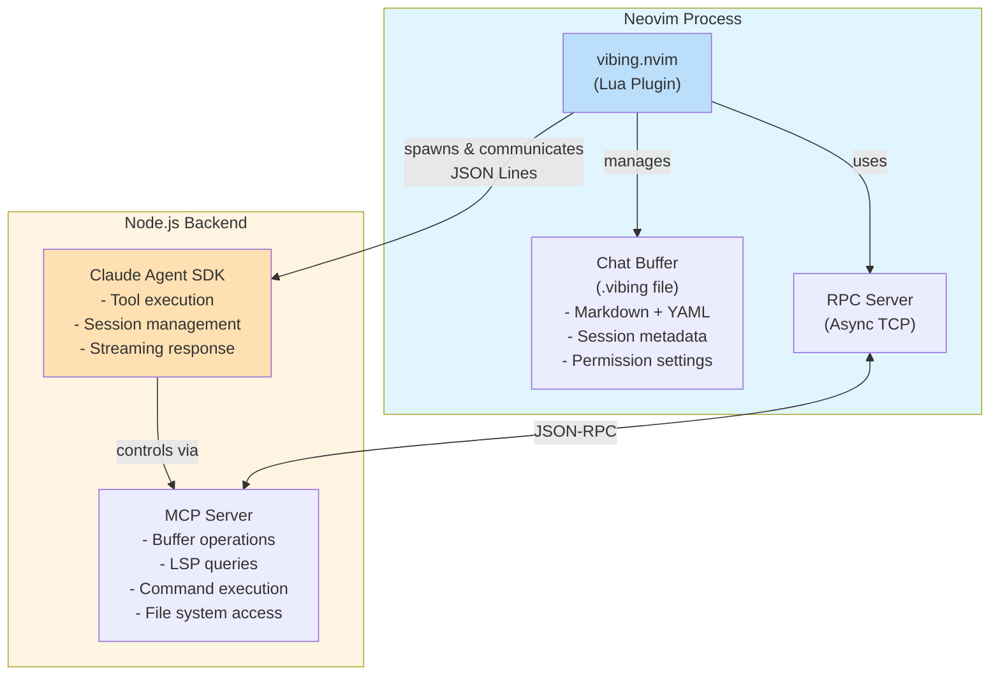

<div align="center">


# vibing.nvim

**Intelligent AI-Powered Code Assistant for Neovim**

[](https://github.com/shabaraba/vibing.nvim/actions/workflows/ci.yml)
[](https://opensource.org/licenses/MIT)
[](https://github.com/shabaraba/vibing.nvim/releases)

A powerful Neovim plugin that seamlessly integrates **Claude AI** through the Agent SDK, bringing
intelligent chat conversations and context-aware inline code actions directly into your editor.

English | [日本語](./README.ja.md)

[Features](#-features) • [Installation](#-installation) • [Usage](#-usage) •
[Configuration](#️-configuration-examples) • [Contributing](#-contributing)

</div>

---

## Table of Contents

- [Why vibing.nvim?](#-why-vibingnvim)
- [Features](#-features)
- [How It Differs](#-how-it-differs)
- [Installation](#-installation)
- [Usage](#-usage)
- [Configuration Examples](#️-configuration-examples)
- [Configuration Reference](#-configuration-reference)
- [Chat File Format](#-chat-file-format)
- [Architecture](#️-architecture)
- [FAQ](#-faq)
- [Contributing](#-contributing)
- [License](#-license)
- [Links](#-links)

## 💡 Why vibing.nvim?

vibing.nvim takes a fundamentally different approach to AI-assisted coding in Neovim.

### Agent-First Architecture

Unlike traditional chat-based AI plugins that send static context to an LLM, vibing.nvim gives Claude **direct access to your Neovim instance** through the Agent SDK and MCP integration.

This means Claude can:

- **Autonomously explore your codebase** - Navigate files, search symbols, and understand project structure without manual context setup
- **Access real-time editor state** - Query LSP diagnostics, symbol definitions, and references on demand
- **Execute Neovim commands** - Perform editor operations as part of its workflow
- **Maintain conversation continuity** - Resume sessions with full context preserved in `.vibing` files

### Designed for Claude

vibing.nvim is purpose-built for Claude, leveraging the official Agent SDK to provide the same capabilities as Claude Code CLI directly within Neovim. This focused approach enables deep integration that multi-provider plugins cannot achieve.

### Concurrent Sessions

Work on multiple tasks simultaneously without blocking:

- **Multiple chat windows** - Open separate conversations, each with its own independent session
- **Queued inline actions** - Stack up code modifications that execute sequentially
- **No waiting** - Start a new chat while another is still processing

Example workflow:

```vim
:VibingChat  " Debug authentication issue in chat 1
:VibingChat  " Design new feature in chat 2
:'<,'>VibingInline fix  " Queue code fix
:'<,'>VibingInline test " Queue test generation
```

All sessions run independently with proper conflict management.

## ✨ Features

### 🤖 Neovim as an Agent Tool

Claude can directly interact with your running Neovim instance via MCP:

- Read and write buffers programmatically
- Execute Ex commands and Lua code
- Query LSP for diagnostics, definitions, references, and symbols
- Navigate the file system within your project

### 💾 File-Based Session Persistence

Each conversation is saved as a `.vibing` file with YAML frontmatter:

- **Portable** - Share conversations with teammates or across machines
- **Resumable** - Continue exactly where you left off with full SDK session state
- **Auditable** - All settings (model, mode, permissions) are visible in the file
- **Version-controllable** - Track AI-assisted changes in Git

### 🛡️ Granular Permission System

Fine-grained control over what Claude can do:

- Allow/deny specific tools (Read, Edit, Write, Bash, etc.)
- Path-based rules for sensitive files
- Command pattern matching for shell operations
- Interactive Permission Builder UI

### 📋 Inline Preview with Accept/Reject

Telescope-style diff preview for all code modifications:

- Visual diff for each changed file
- Accept all or reject all with Git-based revert
- Navigate between multiple modified files
- Works in both inline actions and chat mode

### 🔀 Concurrent Session Support

Run multiple AI tasks simultaneously:

- **Independent chat sessions** - Each chat window maintains its own conversation and session ID
- **Queued inline actions** - Multiple code modifications execute serially to prevent conflicts
- **Parallel workflows** - Debug in one chat while designing features in another

### Other Features

- **💬 Interactive Chat Interface** - Seamless chat window with Claude AI, opens in current buffer by default
- **⚡ Inline Actions** - Quick code fixes, explanations, refactoring, and test generation
- **📝 Natural Language Commands** - Use custom instructions for any code transformation
- **🔧 Slash Commands** - In-chat commands for context management, permissions, and settings
- **🎯 Smart Context** - Automatic file context detection from open buffers and manual additions
- **🌍 Multi-language Support** - Configure different languages for chat and inline actions
- **📊 Diff Viewer** - Visual diff display for AI-edited files with `gd` keybinding
  - Supports both `git diff` and [mote](https://github.com/shabaraba/mote) (fine-grained snapshot tool)
  - Auto-detection: Uses mote if available, fallback to git
- **⚙️ Highly Configurable** - Flexible modes, models, permissions, and UI settings

## 🔄 How It Differs

Different AI coding plugins serve different needs. Here's how vibing.nvim fits in:

### vibing.nvim is ideal if you:

- Use Claude as your primary AI assistant
- Want the AI to autonomously navigate and understand your codebase
- Need persistent, shareable conversation history
- Prefer fine-grained permission controls
- Want to work on multiple AI tasks concurrently
- Want Claude Code CLI capabilities without leaving Neovim

### Consider alternatives if you:

- Need support for multiple LLM providers (OpenAI, Ollama, etc.)
- Prefer minimal dependencies (vibing.nvim requires Node.js)
- Want a battle-tested plugin with large community (we're still growing!)

### Complementary Usage

vibing.nvim focuses on deep Claude integration. You might still use other tools for:

- Quick completions (GitHub Copilot, Codeium)
- Local/offline models (Ollama-based plugins)
- Provider-agnostic workflows

## 📦 Installation

### Using [lazy.nvim](https://github.com/folke/lazy.nvim)

```lua
{
  "shabaraba/vibing.nvim",
  dependencies = {
    -- Optional: for file browser integration
    "stevearc/oil.nvim",
  },
  build = "./build.sh",  -- Builds MCP server for Neovim integration
  config = function()
    require("vibing").setup({
      -- Default configuration
      chat = {
        window = {
          position = "current",  -- "current" | "right" | "left" | "float"
          width = 0.4,
          border = "rounded",
        },
        auto_context = true,
        save_location_type = "project",  -- "project" | "user" | "custom"
        context_position = "append",  -- "prepend" | "append"
      },
      agent = {
        default_mode = "code",  -- "code" | "plan" | "explore"
        default_model = "sonnet",  -- "sonnet" | "opus" | "haiku"
        prioritize_vibing_lsp = true,  -- Prioritize vibing-nvim LSP tools (default: true)
      },
      permissions = {
        mode = "acceptEdits",  -- "default" | "acceptEdits" | "bypassPermissions"
        allow = { "Read", "Edit", "Write", "Glob", "Grep" },
        deny = { "Bash" },
        rules = {},  -- Optional granular permission rules
      },
      preview = {
        enabled = false,  -- Enable diff preview UI (requires Git)
      },
      language = nil,  -- Optional: "ja" | "en" | { default = "ja", chat = "ja", inline = "en" }
    })
  end,
}
```

### Using [packer.nvim](https://github.com/wbthomason/packer.nvim)

```lua
use {
  "shabaraba/vibing.nvim",
  run = "./build.sh",  -- Builds MCP server for Neovim integration
  config = function()
    require("vibing").setup()
  end,
}
```

## 🚀 Usage

### User Commands

| Command                               | Description                                                                       |
| ------------------------------------- | --------------------------------------------------------------------------------- |
| `:VibingChat [position\|file]`        | Create new chat with optional position (current\|right\|left) or open saved file  |
| `:VibingToggleChat`                   | Toggle existing chat window (preserve current conversation)                       |
| `:VibingSlashCommands`                | Show slash command picker in chat                                                 |
| `:VibingContext [path]`               | Add file to context (or from oil.nvim if no path)                                 |
| `:VibingClearContext`                 | Clear all context                                                                 |
| `:VibingInline [action\|instruction]` | Rich UI picker (no args) or direct execution (with args). Tab completion enabled. |
| `:VibingInlineAction`                 | Alias of `:VibingInline` (for backward compatibility)                             |
| `:VibingCancel`                       | Cancel current request                                                            |
| `:VibingCopyUnsentUserHeader`         | Copy `## User <!-- unsent -->` to clipboard                                       |

**Command Semantics:**

- **`:VibingChat`** - Always creates a fresh chat window. Optionally specify position (`current`, `right`, `left`) to control window placement.
  - `:VibingChat` - New chat using default position from config
  - `:VibingChat current` - New chat in current window
  - `:VibingChat right` - New chat in right split
  - `:VibingChat left` - New chat in left split
  - `:VibingChat path/to/file.vibing` - Open saved chat file
- **`:VibingToggleChat`** - Use to show/hide your current conversation. Preserves the existing chat state.

### Inline Actions

**Rich UI Picker (recommended):**

```vim
:'<,'>VibingInline
" Opens a split-panel UI:
" - Left: Action menu (fix, feat, explain, refactor, test)
"   Navigate with j/k or arrow keys, Tab to move to input
" - Right: Additional instruction input (optional)
"   Shift-Tab to move back to menu
" - Enter to execute, Esc/Ctrl-c to cancel
```

**Keybindings:**

- `j`/`k` or `↓`/`↑` - Navigate action menu
- `Tab` - Move from menu to input field
- `Shift-Tab` - Move from input field to menu
- `Enter` - Execute selected action
- `Esc` or `Ctrl-c` - Cancel

**Direct Execution (with arguments):**

```vim
:'<,'>VibingInline fix       " Fix code issues
:'<,'>VibingInline feat      " Implement feature
:'<,'>VibingInline explain   " Explain code
:'<,'>VibingInline refactor  " Refactor code
:'<,'>VibingInline test      " Generate tests

" With additional instructions
:'<,'>VibingInline fix using async/await
:'<,'>VibingInline test with Jest mocks
```

**Natural Language Instructions:**

```vim
:'<,'>VibingInline "Convert this function to TypeScript"
:'<,'>VibingInline "Add error handling with try-catch"
:'<,'>VibingInline "Optimize this loop for performance"
```

### Inline Preview UI

When `preview.enabled = true` is set in configuration, inline actions display a Telescope-style
preview UI after execution (requires Git repository):

**Layout:**

Inline mode (3 panels):

```text
┌──────────────┬──────────────────────────────────────┐
│ Files (3)    │ Diff Preview                         │
│  > src/a.lua │  @@ -10,5 +10,8 @@                   │
│    src/b.lua │  -old line                           │
│    tests/*.lua  +new line                           │
├──────────────┴──────────────────────────────────────┤
│ Response: Modified 3 files successfully             │
└─────────────────────────────────────────────────────┘
```

Chat mode (2 panels):

```text
┌──────────────┬──────────────────────────────────────┐
│ Files (3)    │ Diff Preview                         │
│  > src/a.lua │  @@ -10,5 +10,8 @@                   │
│    src/b.lua │  -old line                           │
│    tests/*.lua  +new line                           │
└──────────────┴──────────────────────────────────────┘
```

**Keybindings:**

- `j`/`k` - Move cursor up/down (normal Neovim navigation)
- `<Enter>` - Select file at cursor position (in Files window)
- `<Tab>` - Cycle to next window (Files → Diff → Response → Files)
- `<Shift-Tab>` - Cycle to previous window
- `a` - Accept all changes (close preview, keep modifications)
- `r` - Reject all changes (revert all files using `git checkout HEAD`)
- `q`/`Esc` - Close preview (keep changes)

**Features:**

- Responsive layout (horizontal ≥120 columns, vertical <120 columns)
- Delta integration for enhanced diff highlighting (if available)
- Navigate through multiple modified files
- Accept/Reject individual or all changes
- Git-based revert functionality

### Slash Commands (in Chat)

| Command                   | Description                                                      |
| ------------------------- | ---------------------------------------------------------------- |
| `/context <file>`         | Add file to context                                              |
| `/clear`                  | Clear context                                                    |
| `/save`                   | Save current chat                                                |
| `/summarize`              | Summarize conversation                                           |
| `/mode <mode>`            | Set execution mode (auto/plan/code/explore)                      |
| `/model <model>`          | Set AI model (opus/sonnet/haiku)                                 |
| `/permissions` or `/perm` | Interactive permission builder - configure tool allow/deny rules |
| `/allow [tool]`           | Add tool to allow list, or show current list if no args          |
| `/deny [tool]`            | Add tool to deny list, or show current list if no args           |

### Chat Keybindings

In chat buffers, the following keybindings are available:

| Key  | Description                                                                      |
| ---- | -------------------------------------------------------------------------------- |
| `gd` | Show diff for file under cursor (in Modified Files section)                      |
| `gf` | Open file under cursor (in Modified Files section)                               |
| `gp` | **Preview all modified files** - Opens Telescope-style preview UI (requires Git) |
| `q`  | Close chat window                                                                |

**Preview All Modified Files (`gp`):**

When Claude modifies multiple files in a chat session, press `gp` anywhere in the chat buffer to open
the inline preview UI showing all modified files at once. This provides the same Accept/Reject
functionality as inline actions:

- Navigate between files with `j`/`k`
- Press `a` to accept all changes
- Press `r` to reject and revert all changes (via `git checkout HEAD`)
- Press `q` to quit preview

## ⚙️ Configuration Examples

### Basic Setup

```lua
require("vibing").setup()
```

If you don't provide any configuration, the following **default permissions** will be applied:

```lua
permissions = {
  mode = "acceptEdits",  -- Auto-accept file edits, ask for other tools
  allow = {
    "Read",    -- Read files
    "Edit",    -- Edit files
    "Write",   -- Write new files
    "Glob",    -- Search files by pattern
    "Grep",    -- Search file contents
  },
  deny = {
    "Bash",    -- Block shell commands (security)
  },
}
```

These defaults are used as a **template** when creating new chat files. Each chat file's frontmatter
contains its own permissions, which are used at runtime.

### Custom Configuration

```lua
require("vibing").setup({
  chat = {
    window = {
      position = "float",
      width = 0.6,
      border = "single",
    },
    save_location_type = "user",  -- Global chat history
  },
  agent = {
    default_mode = "plan",  -- Start in planning mode
    default_model = "opus",  -- Use most capable model
  },
  permissions = {
    allow = { "Read", "Edit", "Write", "Glob", "Grep", "WebSearch" },
    deny = {},  -- Allow all tools
  },
  preview = {
    enabled = true,  -- Enable diff preview UI
  },
  keymaps = {
    send = "<C-CR>",  -- Custom send key
    cancel = "<C-c>",
    add_context = "<C-a>",
  },
})
```

### Project-Specific Settings

```lua
-- Store chats in project directory
require("vibing").setup({
  chat = {
    save_location_type = "project",  -- .vibing/chat/ in project root
  },
})
```

### Custom Save Location

```lua
require("vibing").setup({
  chat = {
    save_location_type = "custom",
    save_dir = "~/my-ai-chats/vibing/",
  },
})
```

### Granular Permission Rules

```lua
require("vibing").setup({
  permissions = {
    mode = "default",  -- Ask for confirmation each time
    rules = {
      -- Allow reading specific paths
      {
        tools = { "Read" },
        paths = { "src/**", "tests/**" },
        action = "allow",
      },
      -- Deny writing to critical files
      {
        tools = { "Write", "Edit" },
        paths = { ".env", "*.secret" },
        action = "deny",
        message = "Cannot modify sensitive files",
      },
      -- Allow specific npm commands only
      {
        tools = { "Bash" },
        commands = { "npm", "yarn" },
        action = "allow",
      },
      -- Deny dangerous bash patterns
      {
        tools = { "Bash" },
        patterns = { "^rm -rf", "^sudo" },
        action = "deny",
        message = "Dangerous command blocked",
      },
    },
  },
})
```

### Multi-language Configuration

```lua
require("vibing").setup({
  -- Simple: All responses in Japanese
  language = "ja",

  -- Advanced: Different languages for chat and inline
  -- language = {
  --   default = "ja",
  --   chat = "ja",     -- Chat in Japanese
  --   inline = "en",   -- Inline actions in English
  -- },
})
```

### Daily Summary Configuration

```lua
require("vibing").setup({
  daily_summary = {
    save_dir = ".vibing/daily-reports/",  -- Custom save directory (relative path)
    -- If not set, defaults to <chat_save_dir>/daily/
  },
})

-- Or use home directory with vim.fn.expand()
require("vibing").setup({
  daily_summary = {
    save_dir = vim.fn.expand("~/Documents/vibing-daily/"),  -- Expand ~ to home directory
  },
})

-- Specify search directories for VibingDailySummaryAll
require("vibing").setup({
  daily_summary = {
    search_dirs = {
      "~/workspaces",  -- Recursively searches ALL .vibing files under this directory
    },
    -- When search_dirs is set, VibingDailySummaryAll searches ONLY these directories
    -- Each directory is recursively searched for .vibing files
    -- e.g., ~/workspaces/project-a/.vibing/chat/*.vibing will be found
    -- ~ is automatically expanded to home directory
  },
})
```

### Tool Markers Configuration

Customize visual markers for tool execution with optional pattern matching:

```lua
require("vibing").setup({
  ui = {
    tool_markers = {
      Task = "▶",           -- Task tool start marker
      TaskComplete = "✓",   -- Task tool complete marker
      default = "⏺",        -- Default marker for other tools

      -- Simple string markers
      Read = "📄",
      Edit = "✏️",
      Write = "📝",

      -- Pattern matching for command-specific markers
      Bash = {
        default = "💻",     -- Default Bash marker
        patterns = {
          -- Package manager operations (supports npm/pnpm/yarn/bun)
          ["^(npm|pnpm|yarn|bun) install"] = "📦⬇",
          ["^(npm|pnpm|yarn|bun) run"] = "📦▶",

          -- Git operations
          ["^git (commit|push|pull)"] = "🌿📝",
          ["^git checkout"] = "🌿🔀",

          -- Docker operations
          ["^docker (build|compose)"] = "🐳🔨",
          ["^docker run"] = "🐳▶",

          -- Build tools
          ["^(cargo|go) build"] = "🔨",
          ["^(cargo|go) test"] = "🧪",
        }
      },
    },
  },
})
```

**Pattern Matching Features:**

- Supports full JavaScript regex syntax
- Patterns are evaluated in definition order (first match wins)
- Invalid patterns are caught and logged to console
- More specific patterns should be defined before general ones

## 📚 Configuration Reference

Complete reference of all configuration options:

### Agent Settings

Controls Claude Agent SDK behavior:

```lua
agent = {
  default_mode = "code",    -- Default execution mode
                            -- "code": Direct implementation
                            -- "plan": Plan first, then implement
                            -- "explore": Explore and analyze codebase

  default_model = "sonnet", -- Default Claude model
                            -- "sonnet": Balanced (recommended)
                            -- "opus": Most capable
                            -- "haiku": Fastest

  prioritize_vibing_lsp = true,  -- Prioritize vibing-nvim LSP tools
                                 -- true: Use vibing-nvim LSP (connects to running Neovim)
                                 -- false: Allow generic LSP tools (e.g., Serena)
                                 -- Default: true
}
```

### Chat Settings

Chat window and session configuration:

```lua
chat = {
  window = {
    position = "current",  -- Window position
                          -- "current": Open in current window
                          -- "right": Right vertical split
                          -- "left": Left vertical split
                          -- "float": Floating window

    width = 0.4,          -- Window width (0-1: ratio, >1: absolute columns)
    border = "rounded",   -- Border style: "rounded" | "single" | "double" | "none"
  },

  auto_context = true,     -- Automatically add open buffers to context

  save_location_type = "project",  -- Chat file save location
                                   -- "project": .vibing/chat/ in project root
                                   -- "user": ~/.local/share/nvim/vibing/chats/
                                   -- "custom": Use save_dir path

  save_dir = "~/.local/share/nvim/vibing/chats",  -- Used when save_location_type="custom"

  context_position = "append",  -- Where to add new context files
                               -- "append": Add to end of context list
                               -- "prepend": Add to beginning
}
```

### Permissions

Control what tools Claude can use. See [Granular Permission Rules](#granular-permission-rules) for
detailed examples.

```lua
permissions = {
  mode = "acceptEdits",  -- Permission mode
                        -- "default": Ask for confirmation each time
                        -- "acceptEdits": Auto-approve Edit/Write (recommended)
                        -- "bypassPermissions": Auto-approve all (use with caution)

  allow = {              -- Tools to allow (empty = allow all except denied)
    "Read",              -- Read files
    "Edit",              -- Edit existing files
    "Write",             -- Create new files
    "Glob",              -- Search files by pattern
    "Grep",              -- Search file contents
    -- "Bash",           -- Execute shell commands (security risk)
    -- "WebSearch",      -- Search the web
    -- "WebFetch",       -- Fetch web pages
  },

  deny = {               -- Tools to deny (takes precedence over allow)
    "Bash",              -- Block shell commands by default
  },

  rules = {},            -- Advanced: Granular permission rules
                        -- See Granular Permission Rules section
}
```

### Keymaps

Chat buffer key bindings:

```lua
keymaps = {
  send = "<CR>",         -- Send message
  cancel = "<C-c>",      -- Cancel current request
  add_context = "<C-a>", -- Add file to context
  open_diff = "gd",      -- Open diff viewer on file paths
  open_file = "gf",      -- Open file on file paths
}
```

### Preview Settings

Configure diff preview UI for inline actions and chat:

```lua
preview = {
  enabled = false,  -- Enable Telescope-style diff preview UI
                    -- Requires Git repository
                    -- Shows Accept/Reject UI after code modifications
                    -- Uses git diff and git checkout for revert
                    -- Works in both inline actions and chat (gp key)
}
```

### UI Settings

Configure UI appearance and behavior:

```lua
ui = {
  wrap = "on",  -- Line wrapping behavior
                -- "nvim": Respect Neovim defaults (don't modify wrap settings)
                -- "on": Enable wrap + linebreak (recommended for chat readability)
                -- "off": Disable line wrapping

  tool_result_display = "compact",  -- Tool execution result display mode
                                    -- "none": Don't show tool results
                                    -- "compact": Show first 100 characters only (default)
                                    -- "full": Show complete tool output

  gradient = {
    enabled = true,  -- Enable gradient animation during AI response
    colors = {
      "#cc3300",  -- Start color (orange, matching vibing.nvim logo)
      "#fffe00",  -- End color (yellow, matching vibing.nvim logo)
    },
    interval = 100,  -- Animation update interval in milliseconds
  },

  tool_markers = {
    Task = "▶",           -- Task tool start marker
    TaskComplete = "✓",   -- Task tool complete marker
    default = "⏺",        -- Default marker for other tools

    -- Simple string markers (optional)
    -- Read = "📄",
    -- Edit = "✏️",
    -- Write = "📝",

    -- Pattern matching for command-specific markers (optional)
    -- Supports full JavaScript regex syntax with grouping and alternation
    -- Bash = {
    --   default = "💻",
    --   patterns = {
    --     ["^(npm|pnpm|yarn|bun) install"] = "📦⬇",
    --     ["^(npm|pnpm|yarn|bun) run"] = "📦▶",
    --     ["^git (commit|push|pull)"] = "🌿📝",
    --     ["^docker (build|compose)"] = "🐳🔨",
    --   }
    -- },
  },
}
```

### MCP (Model Context Protocol)

Enable Claude to directly control Neovim:

```lua
mcp = {
  enabled = false,               -- Enable MCP integration
  rpc_port = 9876,              -- RPC server port
  auto_setup = false,           -- Auto-build MCP server on plugin install
  auto_configure_claude_json = false,  -- Auto-configure ~/.claude.json
}
```

**What is `auto_configure_claude_json`?**

When enabled, automatically adds vibing.nvim MCP server to `~/.claude.json`:

```json
{
  "mcpServers": {
    "vibing-nvim": {
      "command": "node",
      "args": ["/path/to/vibing.nvim/mcp-server/dist/index.js"],
      "env": { "VIBING_RPC_PORT": "9876" }
    }
  }
}
```

This allows Claude Code CLI to control your Neovim instance (read/write buffers, execute commands).

**Recommended for lazy.nvim:**

```lua
{
  "shabaraba/vibing.nvim",
  build = "./build.sh",
  config = function()
    require("vibing").setup({
      mcp = {
        enabled = true,
        auto_setup = true,              -- Build on install
        auto_configure_claude_json = true,  -- Auto-configure
      },
    })
  end,
}
```

### Node.js Executable

Configure which Node.js executable to use:

```lua
node = {
  executable = "auto",  -- Node.js executable path
                        -- "auto": Auto-detect from PATH (default)
                        -- "/usr/bin/node": Explicit path to node binary
                        -- "/usr/local/bin/bun": Use bun instead of node
                        -- Can also be set via VIBING_NODE_EXECUTABLE env var
}
```

**When to use this:**

- **Custom Node.js location**: If node is not in your PATH
- **Alternative runtime**: Use bun or another Node.js-compatible runtime
- **Build environment**: Control which Node.js binary is used during `build.sh`

**Build-time configuration:**

During plugin installation (`build.sh`), you can set the `VIBING_NODE_EXECUTABLE` environment
variable:

```bash
VIBING_NODE_EXECUTABLE=/usr/local/bin/bun ./build.sh
```

Or in your Lazy.nvim config:

```lua
{
  "shabaraba/vibing.nvim",
  build = "VIBING_NODE_EXECUTABLE=/usr/local/bin/bun ./build.sh",
  config = function()
    require("vibing").setup({
      node = {
        executable = "/usr/local/bin/bun",  -- Runtime executable
      },
    })
  end,
}
```

### Language

Configure AI response language:

```lua
-- Simple: All responses in one language
language = "ja"  -- or "en", "fr", etc.

-- Advanced: Different languages per context
language = {
  default = "ja",  -- Default language
  chat = "ja",     -- Chat window responses
  inline = "en",   -- Inline action responses
}
```

### Daily Summary

Configure daily summary generation:

```lua
daily_summary = {
  save_dir = nil,  -- Custom save directory for daily summaries
                   -- nil: Auto-detect from chat save directory
                   --      If chat_save_dir ends with "/chat/", uses "/daily/"
                   --      Otherwise, appends "daily/" to chat_save_dir
                   -- string: Custom path
                   --      Relative: ".vibing/daily-reports/"
                   --      Absolute: "/path/to/reports/"
                   --      Home dir: vim.fn.expand("~/Documents/vibing-daily/")

  search_dirs = nil,  -- Search directories for VibingDailySummaryAll
                      -- nil: Use default directories (project/.vibing/chat, user data dir, custom save_dir)
                      -- string[]: Parent directories to recursively search for .vibing files
                      --           e.g., { "~/workspaces" } finds all .vibing files under ~/workspaces/
                      --           ~ is automatically expanded
}
```

**Usage:**

```vim
:VibingDailySummary [YYYY-MM-DD]     " Generate summary from current project only
:VibingDailySummaryAll [YYYY-MM-DD]  " Generate summary from all configured directories
```

**Command Differences:**

| Command | Search Scope |
|---------|-------------|
| `VibingDailySummary` | Current project's chat save directory only |
| `VibingDailySummaryAll` | `search_dirs` if configured, otherwise default directories |

Summary files are saved as `YYYY-MM-DD.md` with YAML frontmatter containing metadata (date, source files, total messages).

### Remote Control

For testing and development (advanced):

```lua
remote = {
  socket_path = nil,   -- Auto-detect from NVIM env variable
  auto_detect = true,  -- Enable remote control detection
}
```

## 📝 Chat File Format

Chats are saved as Markdown with YAML frontmatter for session resumption and configuration:

```yaml
---
vibing.nvim: true
session_id: <sdk-session-id>
created_at: 2024-01-01T12:00:00
mode: code  # auto | plan | code | explore
model: sonnet  # sonnet | opus | haiku
permissions_mode: acceptEdits  # default | acceptEdits | bypassPermissions
permissions_allow:
  - Read
  - Edit
  - Write
  - Glob
  - Grep
permissions_deny:
  - Bash
language: ja  # Optional: default language for AI responses
---
# Vibing Chat

## User

Hello, Claude!

## Assistant

Hello! How can I help you today?
```

**Key Features:**

- **Session Resumption**: Automatically resumes conversation using `session_id`
- **Configuration Tracking**: Records mode, model, and permissions for transparency
- **Language Support**: Optional `language` field for consistent AI response language
- **Auditability**: All permissions are visible in frontmatter

## 🏗️ Architecture

For detailed architecture documentation, see [CLAUDE.md](./CLAUDE.md).

### High-Level Overview



### How It Differs from Traditional Approaches

| Aspect         | Traditional REST API | vibing.nvim (Agent SDK)  |
| -------------- | -------------------- | ------------------------ |
| Context        | Manually assembled   | Agent requests on-demand |
| Editor Access  | None (fire & forget) | Full bidirectional MCP   |
| Session State  | Plugin manages       | SDK with resume support  |
| Tool Execution | Plugin implements    | SDK standard tools       |
| Capabilities   | Limited to plugin    | Extensible via MCP       |

**Key Components:**

- **Agent SDK Integration** - Node.js wrapper communicating via JSON Lines
- **MCP Server** - Provides Claude with direct Neovim control
- **Context System** - Automatic and manual file context management
- **Session Persistence** - Resume conversations with full history

### Directory Structure

vibing.nvim is a hybrid project combining Neovim plugin (Lua) and Node.js backend (Agent SDK/MCP).
This structure follows both Neovim plugin conventions and Node.js ecosystem standards.

**Neovim Plugin (required by Neovim runtime):**

- `lua/` - Plugin implementation (Lua modules)
- `plugin/` - Auto-loaded plugin entry point
- `doc/` - Help documentation (`:help vibing`)
- `ftplugin/` - Filetype-specific settings for `.vibing` chat files

**Node.js Backend:**

- `bin/` - Executable wrappers for Agent SDK
- `mcp-server/` - MCP integration server for Neovim control
- `tests/` - Test suite (Lua and Node.js tests)
- `package.json` - Node.js dependencies and scripts

**Documentation:**

- `README.md` - Main user documentation
- `CLAUDE.md` - AI development guidelines and architecture details
- `docs/` - Developer guides (adapter development, performance, examples)
- `CONTRIBUTING.md` - Contribution guide

**Development Configuration:**

- `.editorconfig`, `.prettierrc` - Code style consistency
- `eslint.config.mjs` - Linting configuration
- `.github/` - CI/CD workflows and issue templates
- `build.sh` - Build script for MCP server

## 🤝 Contributing

Contributions are welcome! Please feel free to submit issues or pull requests.

## ❓ FAQ

### Why Claude only? Why not support other providers?

vibing.nvim uses the Claude Agent SDK, which provides capabilities beyond simple chat:

- Built-in tool execution framework
- Session persistence and resume
- MCP integration for editor control

These features are specific to Claude's architecture. Supporting other providers would mean either:

- Losing these capabilities, or
- Reimplementing them from scratch

We chose depth over breadth.

### Why does it require Node.js?

The Claude Agent SDK is a TypeScript/JavaScript library. While we could potentially create Lua bindings, using Node.js directly ensures:

- Full SDK compatibility
- Immediate access to new SDK features
- Reliable MCP server implementation

### How does it compare to Claude Code CLI?

vibing.nvim provides similar capabilities to Claude Code CLI but integrated into Neovim:

- Same Agent SDK underneath
- Same tool execution model
- MCP for editor control (CLI controls terminal, vibing controls Neovim)

Think of it as "Claude Code for Neovim users."

### Can I use vibing.nvim alongside other AI plugins?

Yes. vibing.nvim doesn't conflict with completion plugins (Copilot, Codeium) or other chat plugins. Use vibing.nvim for deep Claude interactions and other tools for quick completions or different providers.

## 📄 License

MIT License - see LICENSE file for details

## 🔗 Links

- [Claude AI](https://claude.ai)
- [Claude Agent SDK](https://github.com/anthropics/anthropic-sdk-typescript)
- [GitHub Repository](https://github.com/shabaraba/vibing.nvim)

---

Made with ❤️ using Claude Code
