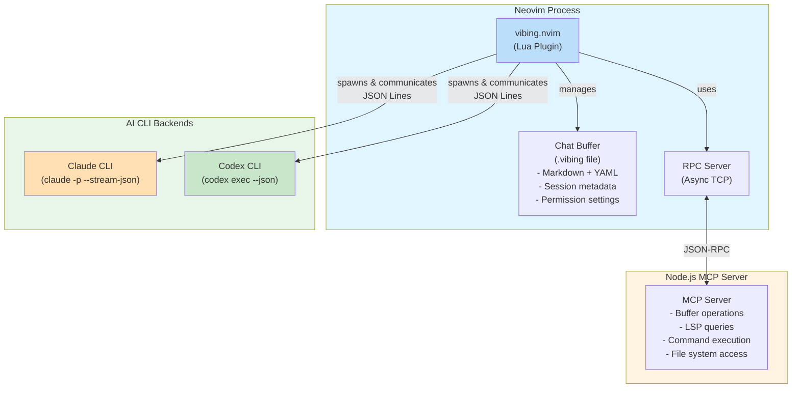

<div align="center">


# vibing.nvim

**Intelligent AI-Powered Code Assistant for Neovim**

[](https://github.com/shabaraba/vibing.nvim/actions/workflows/ci.yml)
[](https://opensource.org/licenses/MIT)
[](https://github.com/shabaraba/vibing.nvim/releases)

A powerful Neovim plugin that integrates **Claude** and **Codex** AI via CLI backends,
bringing intelligent, context-aware chat conversations directly into your editor.

English | [日本語](./README.ja.md)

[Features](#-features) • [Installation](#-installation) • [Usage](#-usage) •
[Configuration](#️-configuration-examples) • [Contributing](#-contributing)

</div>

---

## Table of Contents

- [Why vibing.nvim?](#-why-vibingnvim)
- [Features](#-features)
- [How It Differs](#-how-it-differs)
- [Installation](#-installation)
- [Usage](#-usage)
- [Configuration Examples](#️-configuration-examples)
- [Configuration Reference](#-configuration-reference)
- [Chat File Format](#-chat-file-format)
- [Architecture](#️-architecture)
- [FAQ](#-faq)
- [Contributing](#-contributing)
- [License](#-license)
- [Links](#-links)

## 💡 Why vibing.nvim?

vibing.nvim takes a fundamentally different approach to AI-assisted coding in Neovim.

### CLI Adapter Architecture

Unlike traditional chat-based AI plugins that send static context to an LLM, vibing.nvim gives AI
**direct access to your Neovim instance** through CLI backends and MCP integration.

This means the AI can:

```markdown
- **Autonomously explore your codebase** - Navigate files, search symbols, and understand
  project structure without manual context setup
- **Access real-time editor state** - Query LSP diagnostics, symbol definitions, and references
  on demand
- **Execute Neovim commands** - Perform editor operations as part of its workflow
- **Maintain conversation continuity** - Resume sessions with full context preserved in
  `.vibing` files
```

### Multi-Backend Support

vibing.nvim supports multiple AI CLI backends with a unified interface:

- **Claude CLI** (`claude -p --stream-json`) - Full Claude Code capabilities within Neovim
- **Codex CLI** (`codex exec --json`) - OpenAI Codex backend for alternative AI workflows
- **Grok Build CLI** (`grok -p --output-format streaming-json`) - xAI Grok backend

Switch backends globally via `adapter` config or per-chat via the `agent` frontmatter field.

### Concurrent Sessions

Work on multiple tasks simultaneously without blocking:

- **Multiple chat windows** - Open separate conversations, each with its own independent session
- **No waiting** - Start a new chat while another is still processing

Example workflow:

```vim
:VibingChat  " Debug authentication issue in chat 1
:VibingChat  " Design new feature in chat 2
```

All sessions run independently with proper conflict management.

## ✨ Features

### 🤖 Neovim as an Agent Tool

Claude can directly interact with your running Neovim instance via MCP:

- Read and write buffers programmatically
- Execute Ex commands and Lua code
- Query LSP for diagnostics, definitions, references, and symbols
- Navigate the file system within your project

### 💾 File-Based Session Persistence

Each conversation is saved as a `.vibing` file with YAML frontmatter:

- **Portable** - Share conversations with teammates or across machines
- **Resumable** - Continue exactly where you left off with full SDK session state
- **Auditable** - All settings (model, mode, permissions) are visible in the file
- **Version-controllable** - Track AI-assisted changes in Git

### 🛡️ Granular Permission System

Fine-grained control over what Claude can do:

- Allow/deny specific tools (Read, Edit, Write, Bash, etc.)
- Path-based rules for sensitive files
- Command pattern matching for shell operations
- Interactive Permission Builder UI

### 📋 Diff Preview with Accept/Reject

Telescope-style diff preview for all code modifications:

- Visual diff for each changed file
- Accept all or reject all with Git-based revert
- Navigate between multiple modified files
- Works in chat mode

### 🔀 Concurrent Session Support

Run multiple AI tasks simultaneously:

- **Independent chat sessions** - Each chat window maintains its own conversation and session ID
- **Parallel workflows** - Debug in one chat while designing features in another

### Other Features

- **💬 Interactive Chat Interface** - Seamless chat window with Claude AI, opens in current buffer by default
- **🔧 Slash Commands** - In-chat commands for context management, permissions, and settings
- **🎯 Smart Context** - Automatic file context detection from open buffers and manual additions
- **🌍 Multi-language Support** - Configure language for chat
- **📊 Diff Viewer** - Visual diff display for AI-edited files with `gd` keybinding
  - Supports both `git diff` and [mote](https://github.com/shabaraba/mote) (fine-grained snapshot tool)
  - Auto-detection: Uses mote if available, fallback to git
- **⚙️ Highly Configurable** - Flexible modes, models, permissions, and UI settings

## 🔄 How It Differs

Different AI coding plugins serve different needs. Here's how vibing.nvim fits in:

### vibing.nvim is ideal if you:

- Use Claude or Codex as your AI assistant
- Want the AI to autonomously navigate and understand your codebase
- Need persistent, shareable conversation history
- Prefer fine-grained permission controls
- Want to work on multiple AI tasks concurrently
- Want Claude Code / Codex CLI capabilities without leaving Neovim

### Consider alternatives if you:

- Need support for local/offline models (Ollama, etc.)
- Prefer minimal dependencies (vibing.nvim requires Node.js for the MCP server)
- Want a battle-tested plugin with large community (we're still growing!)

### Complementary Usage

vibing.nvim focuses on deep Claude integration. You might still use other tools for:

- Quick completions (GitHub Copilot, Codeium)
- Local/offline models (Ollama-based plugins)
- Provider-agnostic workflows

## 📦 Installation

### Prerequisites

- **Neovim** 0.9+
- **Node.js** 18+ (for the MCP server)
- At least one AI CLI backend:
  - **Claude CLI** (`claude`) — Install via `npm install -g @anthropic-ai/claude-code`
  - **Codex CLI** (`codex`) — Install via `npm install -g @openai/codex`
  - **Grok Build CLI** (`grok`) — Install via `curl -fsSL https://x.ai/cli/install.sh | bash` (requires `XAI_API_KEY` or `grok` login)

### Claude Code Plugin (MCP + Skills + Agents)

vibing.nvim is also distributed as a [Claude Code plugin](https://code.claude.com/docs/en/plugins),
which bundles the `vibing-nvim` MCP server together with Neovim-aware skills and a read-only
navigation subagent — no manual `~/.claude.json` editing required.

**Automatic:** if you install with `build = "./build.sh"` (see below) and have the `claude` CLI
on your `PATH`, `build.sh` runs `claude plugin marketplace add` + `claude plugin install ... --scope
user` for you on every build — nothing else to do.

**Manual:** to install it yourself (e.g. without running `build.sh`, or on a different machine):

```text
/plugin marketplace add shabaraba/vibing.nvim
/plugin install vibing-nvim@vibing-nvim
```

Either way, this registers the `vibing-nvim` MCP server (same tools as `mcp__vibing-nvim__*`
described below), adds the `nvim-context` and `nvim-lsp-navigation` skills (teach Claude to read
live buffer/window/cursor state and prefer LSP over grep when a Neovim instance is connected), and
the `nvim-navigator` subagent (read-only code navigation via `@vibing-nvim:nvim-navigator`).

The bundled MCP server builds itself (`npm install && npm run build`) on first launch, so no
separate build step is needed for the MCP server itself — this is independent of the Neovim-side
`build.sh`, which is still required to build the plugin's other native pieces (see below). You
still need Neovim running with `mcp = { enabled = true }` (the default) for the MCP tools to have
anything to connect to.

**Uninstalling:**

```text
/plugin uninstall vibing-nvim@vibing-nvim
/plugin marketplace remove vibing-nvim
```

### Using [lazy.nvim](https://github.com/folke/lazy.nvim)

```lua
{
  "shabaraba/vibing.nvim",
  dependencies = {
    -- Optional: for file browser integration
    "stevearc/oil.nvim",
  },
  build = "./build.sh",  -- Builds MCP server for Neovim integration
  config = function()
    require("vibing").setup({
      -- Default configuration
      adapter = "claude",  -- "claude" | "codex" | "grok" (global default; overridable per-chat via frontmatter)
      chat = {
        window = {
          position = "current",  -- "current" | "right" | "left" | "top" | "bottom" | "back" | "float"
          width = 0.4,
          height = 0.4,
          border = "rounded",
        },
        auto_context = true,
        save_location_type = "project",  -- "project" | "user" | "custom"
        context_position = "append",  -- "prepend" | "append"
      },
      agent = {
        default_mode = "code",  -- "code" | "plan" | "explore"
        default_model = "sonnet",  -- "sonnet" | "opus" | "haiku" | "fable"
        prioritize_vibing_lsp = true,  -- Prioritize vibing-nvim LSP tools (default: true)
      },
      permissions = {
        mode = "acceptEdits",  -- "default" | "acceptEdits" | "bypassPermissions" | "plan" | "dontAsk" | "auto"
        allow = { "Read", "Edit", "Write", "Glob", "Grep", "Skill" },
        deny = { "Bash" },
        rules = {},  -- Optional granular permission rules
      },
      preview = {
        enabled = false,  -- Enable diff preview UI (requires Git)
      },
      language = nil,  -- Optional: "ja" | "en" | { default = "ja", chat = "ja" }
    })
  end,
}
```

### Using [packer.nvim](https://github.com/wbthomason/packer.nvim)

```lua
use {
  "shabaraba/vibing.nvim",
  run = "./build.sh",  -- Builds MCP server for Neovim integration
  config = function()
    require("vibing").setup()
  end,
}
```

## 🚀 Usage

### User Commands

| Command                               | Description                                                                                         |
| ------------------------------------- | --------------------------------------------------------------------------------------------------- |
| `:VibingChat [position\|file]`        | Create new chat with optional position (current\|right\|left\|top\|bottom\|back) or open saved file |
| `:VibingToggleChat`                   | Toggle existing chat window (preserve current conversation)                                         |
| `:VibingChatFork [position]`          | Fork current chat (create branch from current conversation)                                         |
| `:VibingSlashCommands`                | Show slash command picker in chat                                                                   |
| `:VibingSetFileTitle`                 | Generate AI title and rename chat file                                                              |
| `:VibingSummarize`                    | Generate AI summary of chat history and insert into buffer                                          |
| `:VibingDeleteChats [--unrenamed]`    | Delete chat files (use --unrenamed to delete all unrenamed files)                                   |
| `:VibingContext [path]`               | Add file to context (or from oil.nvim if no path)                                                   |
| `:VibingClearContext`                 | Clear all context                                                                                   |
| `:VibingCancel`                       | Cancel current request                                                                              |
| `:VibingReloadCommands`               | Reload custom slash commands                                                                        |
| `:VibingCopyUnsentUserHeader`         | Copy `## User <!-- unsent -->` to clipboard                                                         |
| `:VibingDailySummary [YYYY-MM-DD]`    | Generate daily summary from project chat files (default: today)                                     |
| `:VibingDailySummaryAll [YYYY-MM-DD]` | Generate daily summary from all chat files (default: today)                                         |

**Command Semantics:**

- **`:VibingChat`** - Always creates a fresh chat window. Optionally specify position to control window placement.
  - `:VibingChat` - New chat using default position from config
  - `:VibingChat current` - New chat in current window
  - `:VibingChat right` - New chat in right split
  - `:VibingChat left` - New chat in left split
  - `:VibingChat top` - New chat in top split
  - `:VibingChat bottom` - New chat in bottom split
  - `:VibingChat back` - New chat as background buffer only (no window)
  - `:VibingChat path/to/file.md` - Open saved chat file
- **Worktree lifecycle** - Use the `vibing-worktree` Claude Code skill bundled with this plugin, entirely via natural language, to list/create/attach/finish git worktrees under `.vibing/worktrees/<branch>/`.
- **`:VibingChatFork`** - Fork current chat conversation for branching in a different direction.
- **`:VibingToggleChat`** - Use to show/hide your current conversation. Preserves the existing chat state.

### Slash Commands (in Chat)

| Command                   | Description                                                              |
| ------------------------- | ------------------------------------------------------------------------ |
| `/context <file>`         | Add file to context                                                      |
| `/clear`                  | Clear context                                                            |
| `/save`                   | Save current chat                                                        |
| `/summarize`              | Summarize conversation                                                   |
| `/model <model>`          | Set AI model (opus/sonnet/haiku/fable)                                   |
| `/help`                   | Show available slash commands                                            |
| `/permissions` or `/perm` | Interactive permission builder - configure tool allow/deny rules         |
| `/allow [tool]`           | Add tool to allow list, or show current list if no args                  |
| `/deny [tool]`            | Add tool to deny list, or show current list if no args                   |
| `/ask [tool]`             | Ask before using tool, or show current list if no args                   |
| `/permission [mode]`      | Set permission mode (default/acceptEdits/bypassPermissions/plan/dontAsk) |
| `/new-session`            | Reset session and start fresh                                            |

Worktree lifecycle is handled by the `vibing-worktree` Claude Code skill bundled with this
plugin, not by chat slash commands — see `skills/vibing-worktree/SKILL.md`.

### Chat Keybindings

In chat buffers, the following keybindings are available:

| Key  | Description                                                                      |
| ---- | -------------------------------------------------------------------------------- |
| `gd` | Show diff for file under cursor (in Modified Files section)                      |
| `gf` | Open file under cursor (in Modified Files section)                               |
| `gp` | **Preview all modified files** - Opens Telescope-style preview UI (requires Git) |
| `q`  | Close chat window                                                                |

**Preview All Modified Files (`gp`):**

When Claude modifies multiple files in a chat session, press `gp` anywhere in the chat buffer to open
the preview UI showing all modified files at once. This provides Accept/Reject
functionality:

- Navigate between files with `j`/`k`
- Press `a` to accept all changes
- Press `r` to reject and revert all changes (via `git checkout HEAD`)
- Press `q` to quit preview

## ⚙️ Configuration Examples

### Basic Setup

```lua
require("vibing").setup()
```

If you don't provide any configuration, the following **default permissions** will be applied:

```lua
permissions = {
  mode = "acceptEdits",  -- Auto-accept file edits, ask for other tools
  allow = {
    "Read",    -- Read files
    "Edit",    -- Edit files
    "Write",   -- Write new files
    "Glob",    -- Search files by pattern
    "Grep",    -- Search file contents
    "Skill",   -- Use skills (slash commands and workflows)
  },
  deny = {
    "Bash",    -- Block shell commands (security)
  },
}
```

These defaults are used as a **template** when creating new chat files. Each chat file's frontmatter
contains its own permissions, which are used at runtime.

### Custom Configuration

```lua
require("vibing").setup({
  chat = {
    window = {
      position = "float",
      width = 0.6,
      border = "single",
    },
    save_location_type = "user",  -- Global chat history
  },
  agent = {
    default_mode = "plan",  -- Start in planning mode
    default_model = "opus",  -- Use most capable model
  },
  permissions = {
    allow = { "Read", "Edit", "Write", "Glob", "Grep", "Skill", "WebSearch" },
    deny = {},  -- Allow all tools
  },
  preview = {
    enabled = true,  -- Enable diff preview UI
  },
  keymaps = {
    send = "<C-CR>",  -- Custom send key
    cancel = "<C-c>",
    add_context = "<C-a>",
  },
})
```

### Project-Specific Settings

```lua
-- Store chats in project directory
require("vibing").setup({
  chat = {
    save_location_type = "project",  -- .vibing/chat/ in project root
  },
})
```

### Custom Save Location

```lua
require("vibing").setup({
  chat = {
    save_location_type = "custom",
    save_dir = "~/my-ai-chats/vibing/",
  },
})
```

### Granular Permission Rules

```lua
require("vibing").setup({
  permissions = {
    mode = "default",  -- Ask for confirmation each time
    rules = {
      -- Allow reading specific paths
      {
        tools = { "Read" },
        paths = { "src/**", "tests/**" },
        action = "allow",
      },
      -- Deny writing to critical files
      {
        tools = { "Write", "Edit" },
        paths = { ".env", "*.secret" },
        action = "deny",
        message = "Cannot modify sensitive files",
      },
      -- Allow specific npm commands only
      {
        tools = { "Bash" },
        commands = { "npm", "yarn" },
        action = "allow",
      },
      -- Deny dangerous bash patterns
      {
        tools = { "Bash" },
        patterns = { "^rm -rf", "^sudo" },
        action = "deny",
        message = "Dangerous command blocked",
      },
    },
  },
})
```

### Multi-language Configuration

```lua
require("vibing").setup({
  -- Simple: All responses in Japanese
  language = "ja",

  -- Advanced: Per-context language
  -- language = {
  --   default = "ja",
  --   chat = "ja",     -- Chat in Japanese
  -- },
})
```

### Daily Summary Configuration

```lua
require("vibing").setup({
  daily_summary = {
    save_dir = ".vibing/daily-reports/",  -- Custom save directory (relative path)
    -- If not set, defaults to <chat_save_dir>/daily/
  },
})

-- Or use home directory with vim.fn.expand()
require("vibing").setup({
  daily_summary = {
    save_dir = vim.fn.expand("~/Documents/vibing-daily/"),  -- Expand ~ to home directory
  },
})

-- Specify search directories for VibingDailySummaryAll
require("vibing").setup({
  daily_summary = {
    search_dirs = {
      "~/workspaces",  -- Recursively searches ALL .vibing files under this directory
    },
    -- When search_dirs is set, VibingDailySummaryAll searches ONLY these directories
    -- Each directory is recursively searched for .vibing files
    -- e.g., ~/workspaces/project-a/.vibing/chat/*.vibing will be found
    -- ~ is automatically expanded to home directory
    -- ⚠️ Warning: Large directories (e.g., ~/) may impact performance.
    --            Use specific project directories for better performance.
  },
})
```

### Tool Markers Configuration

Customize visual markers for tool execution with optional pattern matching:

```lua
require("vibing").setup({
  ui = {
    tool_markers = {
      Task = "▶",           -- Task tool start marker
      TaskComplete = "✓",   -- Task tool complete marker
      default = "⏺",        -- Default marker for other tools

      -- Simple string markers
      Read = "📄",
      Edit = "✏️",
      Write = "📝",

      -- Pattern matching for command-specific markers
      Bash = {
        default = "💻",     -- Default Bash marker
        patterns = {
          -- Package manager operations (supports npm/pnpm/yarn/bun)
          ["^(npm|pnpm|yarn|bun) install"] = "📦⬇",
          ["^(npm|pnpm|yarn|bun) run"] = "📦▶",

          -- Git operations
          ["^git (commit|push|pull)"] = "🌿📝",
          ["^git checkout"] = "🌿🔀",

          -- Docker operations
          ["^docker (build|compose)"] = "🐳🔨",
          ["^docker run"] = "🐳▶",

          -- Build tools
          ["^(cargo|go) build"] = "🔨",
          ["^(cargo|go) test"] = "🧪",
        }
      },
    },
  },
})
```

**Pattern Matching Features:**

- Supports full JavaScript regex syntax
- Patterns are evaluated in definition order (first match wins)
- Invalid patterns are caught and logged to console
- More specific patterns should be defined before general ones

## 📚 Configuration Reference

Complete reference of all configuration options:

### Adapter Settings

Select the AI CLI backend:

```lua
adapter = "claude",  -- Global backend adapter
                     -- "claude": Use Claude CLI (claude -p --stream-json)
                     -- "codex":  Use Codex CLI  (codex exec --json)
                     -- "grok":   Use Grok Build CLI (grok -p --output-format streaming-json)
                     -- Can be overridden per-chat via "agent" frontmatter field

-- Optional: explicit path when multiple `grok` binaries exist (official vs community)
grok = {
  executable = "auto",  -- "auto" (PATH) or absolute path to official Grok Build CLI
},
```

### Agent Settings

Controls AI agent behavior:

```lua
agent = {
  default_mode = "code",    -- Default execution mode
                            -- "code": Direct implementation
                            -- "plan": Plan first, then implement
                            -- "explore": Explore and analyze codebase

  default_model = "sonnet", -- Default model
                            -- "sonnet": Balanced (recommended)
                            -- "opus": Most capable
                            -- "haiku": Fastest

  prioritize_vibing_lsp = true,  -- Prioritize vibing-nvim LSP tools
                                 -- true: Use vibing-nvim LSP (connects to running Neovim)
                                 -- false: Allow generic LSP tools (e.g., Serena)
                                 -- Default: true
}
```

### Chat Settings

Chat window and session configuration:

```lua
chat = {
  window = {
    position = "current",  -- Window position
                          -- "current": Open in current window
                          -- "right": Right vertical split
                          -- "left": Left vertical split
                          -- "top": Top horizontal split
                          -- "bottom": Bottom horizontal split
                          -- "back": Background buffer only (no window)
                          -- "float": Floating window

    width = 0.4,          -- Window width (0-1: ratio, >1: absolute columns)
    height = 0.4,         -- Window height (0-1: ratio, >1: absolute rows, for top/bottom)
    border = "rounded",   -- Border style: "rounded" | "single" | "double" | "none"
  },

  auto_context = true,     -- Automatically add open buffers to context

  save_location_type = "project",  -- Chat file save location
                                   -- "project": .vibing/chat/ in project root
                                   -- "user": ~/.local/share/nvim/vibing/chats/
                                   -- "custom": Use save_dir path

  save_dir = "~/.local/share/nvim/vibing/chats",  -- Used when save_location_type="custom"

  context_position = "append",  -- Where to add new context files
                               -- "append": Add to end of context list
                               -- "prepend": Add to beginning
}
```

### Permissions

Control what tools Claude can use. See [Granular Permission Rules](#granular-permission-rules) for
detailed examples.

```lua
permissions = {
  mode = "acceptEdits",  -- Permission mode
                        -- "default": Ask for confirmation each time
                        -- "acceptEdits": Auto-approve Edit/Write (recommended)
                        -- "bypassPermissions": Auto-approve all (use with caution)
                        -- "plan": Read-only planning mode (no tool execution)
                        -- "dontAsk": Deny instead of prompting
                        -- "auto": Automatic selection

  allow = {              -- Tools to allow (empty = allow all except denied)
    "Read",              -- Read files
    "Edit",              -- Edit existing files
    "Write",             -- Create new files
    "Glob",              -- Search files by pattern
    "Grep",              -- Search file contents
    "Skill",             -- Use skills (slash commands and workflows)
    -- "Bash",           -- Execute shell commands (security risk)
    -- "WebSearch",      -- Search the web
    -- "WebFetch",       -- Fetch web pages
  },

  deny = {               -- Tools to deny (takes precedence over allow)
    "Bash",              -- Block shell commands by default
  },

  ask = {},              -- Tools requiring confirmation before use

  rules = {},            -- Advanced: Granular permission rules
                        -- See Granular Permission Rules section
}
```

### Keymaps

Chat buffer key bindings:

```lua
keymaps = {
  send = "<CR>",         -- Send message
  cancel = "<C-c>",      -- Cancel current request
  add_context = "<C-a>", -- Add file to context
  open_diff = "gd",      -- Open diff viewer on file paths
  open_file = "gf",      -- Open file on file paths
}
```

### Preview Settings

Configure diff preview UI for chat:

```lua
preview = {
  enabled = false,  -- Enable Telescope-style diff preview UI
                    -- Requires Git repository
                    -- Shows Accept/Reject UI after code modifications
                    -- Uses git diff and git checkout for revert
                    -- Works in chat (gp key)
}
```

### UI Settings

Configure UI appearance and behavior:

```lua
ui = {
  wrap = "on",  -- Line wrapping behavior
                -- "nvim": Respect Neovim defaults (don't modify wrap settings)
                -- "on": Enable wrap + linebreak (recommended for chat readability)
                -- "off": Disable line wrapping

  tool_result_display = "compact",  -- Tool execution result display mode
                                    -- "none": Don't show tool results
                                    -- "compact": Show first 100 characters only (default)
                                    -- "full": Show complete tool output

  gradient = {
    enabled = true,  -- Enable gradient animation during AI response
    colors = {
      "#cc3300",  -- Start color (orange, matching vibing.nvim logo)
      "#fffe00",  -- End color (yellow, matching vibing.nvim logo)
    },
    interval = 100,  -- Animation update interval in milliseconds
  },

  tool_markers = {
    Task = "▶",           -- Task tool start marker
    TaskComplete = "✓",   -- Task tool complete marker
    default = "⏺",        -- Default marker for other tools

    -- Simple string markers (optional)
    -- Read = "📄",
    -- Edit = "✏️",
    -- Write = "📝",

    -- Pattern matching for command-specific markers (optional)
    -- Supports full JavaScript regex syntax with grouping and alternation
    -- Bash = {
    --   default = "💻",
    --   patterns = {
    --     ["^(npm|pnpm|yarn|bun) install"] = "📦⬇",
    --     ["^(npm|pnpm|yarn|bun) run"] = "📦▶",
    --     ["^git (commit|push|pull)"] = "🌿📝",
    --     ["^docker (build|compose)"] = "🐳🔨",
    --   }
    -- },
  },
}
```

### MCP (Model Context Protocol)

Enable Claude to directly control Neovim. The MCP server is registered exclusively via the
"Claude Code Plugin" install described above (installed automatically by `build.sh`) — there is
no separate `~/.claude.json` registration path, since that route can only ever hardcode a single
default RPC port and silently targets the wrong Neovim instance whenever more than one is running.

```lua
mcp = {
  enabled = true,   -- Enable MCP integration
  rpc_port = 9876,  -- RPC server port
}
```

**Recommended for lazy.nvim:**

```lua
{
  "shabaraba/vibing.nvim",
  build = "./build.sh",
  config = function()
    require("vibing").setup({
      mcp = { enabled = true },
    })
  end,
}
```

### Node.js Executable

Configure the Node.js executable used for the MCP server and internal scripts:

```lua
node = {
  executable = "auto",  -- Node.js executable path
                        -- "auto": Auto-detect from PATH (default)
                        -- "/usr/bin/node": Explicit path to node binary
                        -- "/usr/local/bin/bun": Use bun instead of node
                        -- Can also be set via VIBING_NODE_EXECUTABLE env var

  dev_mode = false,     -- Development mode for plugin development
                        -- true: Run TypeScript scripts directly with bun (no build step)
                        -- false: Use compiled JS from dist/ (default)
}
```

**When to use this:**

- **Custom Node.js location**: If node is not in your PATH
- **Alternative runtime**: Use bun or another Node.js-compatible runtime
- **Build environment**: Control which Node.js binary is used during `build.sh`

**Build-time configuration:**

During plugin installation (`build.sh`), you can set the `VIBING_NODE_EXECUTABLE` environment
variable:

```bash
VIBING_NODE_EXECUTABLE=/usr/local/bin/bun ./build.sh
```

Or in your Lazy.nvim config:

```lua
{
  "shabaraba/vibing.nvim",
  build = "VIBING_NODE_EXECUTABLE=/usr/local/bin/bun ./build.sh",
  config = function()
    require("vibing").setup({
      node = {
        executable = "/usr/local/bin/bun",
      },
    })
  end,
}
```

### Language

Configure AI response language:

```lua
-- Simple: All responses in one language
language = "ja"  -- or "en", "fr", etc.

-- Advanced: Per-context language
language = {
  default = "ja",  -- Default language
  chat = "ja",     -- Chat window responses
}
```

### Daily Summary

Configure daily summary generation:

```lua
daily_summary = {
  save_dir = nil,  -- Custom save directory for daily summaries
                   -- nil: Auto-detect from chat save directory
                   --      If chat_save_dir ends with "/chat/", uses "/daily/"
                   --      Otherwise, appends "daily/" to chat_save_dir
                   -- string: Custom path
                   --      Relative: ".vibing/daily-reports/"
                   --      Absolute: "/path/to/reports/"
                   --      Home dir: vim.fn.expand("~/Documents/vibing-daily/")

  search_dirs = nil,  -- Search directories for VibingDailySummaryAll
                      -- nil: Use default directories (project/.vibing/chat, user data dir, custom save_dir)
                      -- string[]: Parent directories to recursively search for .vibing files
                      --           e.g., { "~/workspaces" } finds all .vibing files under ~/workspaces/
                      --           ~ is automatically expanded
                      -- ⚠️ Warning: Large directories (e.g., ~/) may impact performance.
                      --            Use specific project directories for better performance.
}
```

**Usage:**

```vim
:VibingDailySummary [YYYY-MM-DD]     " Generate summary from current project only
:VibingDailySummaryAll [YYYY-MM-DD]  " Generate summary from all configured directories
```

**Command Differences:**

| Command                 | Search Scope                                               |
| ----------------------- | ---------------------------------------------------------- |
| `VibingDailySummary`    | Current project's chat save directory only                 |
| `VibingDailySummaryAll` | `search_dirs` if configured, otherwise default directories |

Summary files are saved as `YYYY-MM-DD.md` with YAML frontmatter containing metadata (date, source files, total messages).

### Remote Control

For testing and development (advanced):

```lua
remote = {
  socket_path = nil,   -- Auto-detect from NVIM env variable
  auto_detect = true,  -- Enable remote control detection
}
```

## 📝 Chat File Format

Chats are saved as Markdown with YAML frontmatter for session resumption and configuration:

```yaml
---
vibing.nvim: true
session_id: <cli-session-id>
created_at: 2024-01-01T12:00:00
agent: claude  # claude | codex | grok (overrides global adapter setting for this chat)
model: sonnet  # sonnet | opus | haiku | fable
permissions_mode: acceptEdits  # default | acceptEdits | bypassPermissions | plan | dontAsk
permissions_allow:
  - Read
  - Edit
  - Write
  - Glob
  - Grep
permissions_deny:
  - Bash
language: ja  # Optional: default language for AI responses
---
# Vibing Chat

## User

Hello, Claude!

## Assistant

Hello! How can I help you today?
```

**Key Features:**

- **Session Resumption**: Automatically resumes conversation using `session_id`
- **Configuration Tracking**: Records mode, model, and permissions for transparency
- **Language Support**: Optional `language` field for consistent AI response language
- **Auditability**: All permissions are visible in frontmatter

## 🏗️ Architecture

For detailed architecture documentation, see [CLAUDE.md](./CLAUDE.md).

### High-Level Overview


```mermaid
graph TB
    subgraph Neovim["Neovim Process"]
        Plugin["vibing.nvim<br/>(Lua Plugin)"]
        Buffer["Chat Buffer<br/>(.vibing file)<br/>- Markdown + YAML<br/>- Session metadata<br/>- Permission settings"]
        RPC["RPC Server<br/>(Async TCP)"]

        Plugin -->|manages| Buffer
        Plugin -->|uses| RPC
    end

    subgraph MCP["Node.js MCP Server"]
        MCPServer["MCP Server<br/>- Buffer operations<br/>- LSP queries<br/>- Command execution<br/>- File system access"]
    end

    subgraph AI["AI CLI Backends"]
        Claude["Claude CLI<br/>(claude -p --stream-json)"]
        Codex["Codex CLI<br/>(codex exec --json)"]
    end

    RPC <-->|JSON-RPC| MCPServer
    Plugin -->|spawns & communicates<br/>JSON Lines| Claude
    Plugin -->|spawns & communicates<br/>JSON Lines| Codex

    style Neovim fill:#e1f5ff
    style MCP fill:#fff4e1
    style AI fill:#e8f5e9
    style Plugin fill:#bbdefb
    style Claude fill:#ffe0b2
    style Codex fill:#c8e6c9
```

### How It Differs from Traditional Approaches

| Aspect         | Traditional REST API | vibing.nvim (CLI Adapters)    |
| -------------- | -------------------- | ----------------------------- |
| Context        | Manually assembled   | MCP: agent requests on-demand |
| Editor Access  | None (fire & forget) | Full bidirectional MCP        |
| Session State  | Plugin manages       | CLI session with resume       |
| Tool Execution | Plugin implements    | CLI native tools              |
| Capabilities   | Limited to plugin    | Extensible via MCP            |

**Key Components:**

- **CLI Adapters** - Direct execution of `claude` / `codex` CLI communicating via JSON Lines
- **MCP Server** - Provides AI with direct Neovim control (buffers, LSP, commands)
- **Context System** - Automatic and manual file context management
- **Session Persistence** - Resume conversations with full history

### Directory Structure

vibing.nvim is a hybrid project combining Neovim plugin (Lua) and Node.js backend (Agent SDK/MCP).
This structure follows both Neovim plugin conventions and Node.js ecosystem standards.

**Neovim Plugin (required by Neovim runtime):**

- `lua/` - Plugin implementation (Lua modules)
- `plugin/` - Auto-loaded plugin entry point
- `doc/` - Help documentation (`:help vibing`)
- `ftplugin/` - Filetype-specific settings for `.vibing` chat files

**Node.js Backend:**

- `bin/` - Executable wrappers for Agent SDK
- `mcp-server/` - MCP integration server for Neovim control
- `tests/` - Test suite (Lua and Node.js tests)
- `package.json` - Node.js dependencies and scripts

**Documentation:**

- `README.md` - Main user documentation
- `CLAUDE.md` - AI development guidelines and architecture details
- `docs/` - Developer guides (adapter development, performance, examples)
- `CONTRIBUTING.md` - Contribution guide

**Development Configuration:**

- `.editorconfig`, `.prettierrc` - Code style consistency
- `eslint.config.mjs` - Linting configuration
- `.github/` - CI/CD workflows and issue templates
- `build.sh` - Build script for MCP server

## 🤝 Contributing

Contributions are welcome! Please feel free to submit issues or pull requests.

## ❓ FAQ

### Which AI backends are supported?

vibing.nvim currently supports:

- **Claude CLI** (`claude -p --stream-json`) — Full Claude Code capabilities
- **Codex CLI** (`codex exec --json`) — OpenAI Codex backend
- **Grok Build CLI** (`grok -p --output-format streaming-json`) — xAI Grok backend

Switch backends globally with `adapter = "claude"|"codex"|"grok"` in setup, or per-chat by adding
`agent: claude`, `agent: codex`, or `agent: grok` to a chat file's YAML frontmatter.

**Grok notes:** Install the official xAI Grok Build CLI — not the community `grok-dev` package —
and authenticate via `XAI_API_KEY` or `grok` login. vibing injects a project PreToolUse hook under
`<cwd>/.grok/hooks/vibing-nvim-pre-tool-use.json` (reusing `bin/hooks/pre-tool-use.sh`) so
frontmatter allow/deny lists and the Tool Approval UI work the same as Claude/Codex. Streaming
JSON does not currently emit per-tool events, so tool markers in chat are limited compared to Claude.

### Why does it require Node.js?

Node.js is required for the MCP server, which provides AI with direct access to your running
Neovim instance (buffer reads/writes, LSP queries, command execution). The AI CLI binaries
themselves (`claude`, `codex`, `grok`) are separate installs.

### How does it compare to Claude Code CLI?

vibing.nvim provides similar capabilities to Claude Code CLI but integrated into Neovim:

- Same `claude` CLI underneath (when using the Claude backend)
- MCP for editor control (CLI controls terminal, vibing controls Neovim)
- Additional Codex and Grok backends for multi-provider workflows

Think of it as "Claude Code (or Codex / Grok) for Neovim users."

### Can I use vibing.nvim alongside other AI plugins?

Yes. vibing.nvim doesn't conflict with completion plugins (Copilot, Codeium) or other chat plugins. Use vibing.nvim for deep Claude interactions and other tools for quick completions or different providers.

## 📄 License

MIT License - see LICENSE file for details

## 🔗 Links

- [Claude AI](https://claude.ai)
- [Codex CLI](https://github.com/openai/codex)
- [Grok Build CLI](https://x.ai/cli)
- [GitHub Repository](https://github.com/shabaraba/vibing.nvim)

---

Made with ❤️ using Claude Code!
