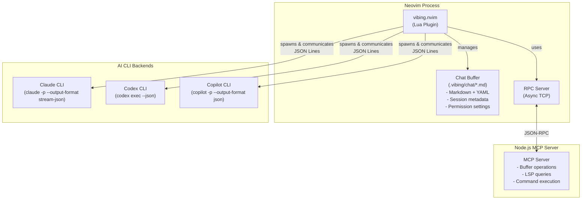

<div align="center">


# vibing.nvim

**Intelligent AI-Powered Code Assistant for Neovim**

[](https://github.com/shabaraba/vibing.nvim/actions/workflows/ci.yml)
[](https://opensource.org/licenses/MIT)
[](https://github.com/shabaraba/vibing.nvim/releases)

A powerful Neovim plugin that integrates **Claude**, **Codex**, and **GitHub Copilot** AI via CLI
backends, bringing intelligent, context-aware chat conversations directly into your editor.

English | [日本語](./README.ja.md)

[Features](#-features) • [Installation](#-installation) • [Usage](#-usage) •
[Configuration](#️-configuration) • [Contributing](#-contributing)

</div>

---

## Table of Contents

- [Features](#-features)
- [Installation](#-installation)
- [Quick Start](#-quick-start)
- [Usage](#-usage)
- [Configuration](#️-configuration)
- [Chat File Format](#-chat-file-format)
- [Architecture](#️-architecture)
- [FAQ](#-faq)
- [Contributing](#-contributing)
- [License](#-license)
- [Links](#-links)

## ✨ Features

Unlike chat plugins that send static context to an LLM, vibing.nvim gives the AI **direct
access to your Neovim instance** through CLI backends and MCP integration.

- **🤖 Neovim as an agent tool** — via MCP, the AI reads and writes buffers, executes commands,
  and queries LSP (diagnostics, definitions, references, symbols) in your _running_ editor
- **🔀 Multi-backend** — Claude CLI (`claude -p --output-format stream-json`), Codex CLI
  (`codex exec --json`), or GitHub Copilot CLI (`copilot -p --output-format json`); switch
  globally via `adapter` or per-chat via the `agent` frontmatter field
- **💾 File-based session persistence** — chats are plain Markdown files with YAML frontmatter
  saved under `.vibing/chat/`: portable, resumable (full CLI session state), auditable, and
  version-controllable
- **🔀 Concurrent sessions** — run multiple independent chats simultaneously; start a new chat
  while another is still processing
- **🛡️ Granular permissions** — allow/deny/ask lists per tool, path-based rules for sensitive
  files, Bash command patterns, and an interactive Permission Builder UI
- **📊 Diff viewer** — `gd` on a changed file shows a before/after diff; per-request patch
  tracking by default, with an opt-in [mote](https://github.com/shabaraba/mote) snapshot
  backend (`diff.tool = "mote"` or `:VibingMoteDir`) that also catches Bash-driven changes
- **🎯 Smart context** — add files manually, from oil.nvim, or from a visual selection
- **🌍 Multi-language support** — configure the AI response language per chat

### Consider alternatives if you

- Need local/offline models (Ollama, etc.)
- Prefer minimal dependencies (vibing.nvim requires Node.js for the MCP server)
- Want a battle-tested plugin with a large community (we're still growing!)

vibing.nvim doesn't conflict with completion plugins (Copilot, Codeium) or other chat plugins —
they compose well.

## 📦 Installation

### Prerequisites

- **Neovim** 0.10+ (uses `vim.system()`)
- **Node.js** 18+ (for the MCP server)
- At least one AI CLI backend:
  - **Claude CLI** (`claude`) — `npm install -g @anthropic-ai/claude-code`
  - **Codex CLI** (`codex`) — `npm install -g @openai/codex`
  - **GitHub Copilot CLI** (`copilot`) — `npm install -g @github/copilot` (needs Node.js 22+,
    higher than the 18+ the MCP server itself requires)

### Using [lazy.nvim](https://github.com/folke/lazy.nvim)

```lua
{
  "shabaraba/vibing.nvim",
  dependencies = {
    "stevearc/oil.nvim",  -- Optional: file browser integration
  },
  build = "./build.sh",  -- Builds the MCP server and registers the Claude Code plugin
  config = function()
    require("vibing").setup()
  end,
}
```

See [Configuration](#️-configuration) for the options you can pass to `setup()`.

### Using [packer.nvim](https://github.com/wbthomason/packer.nvim)

```lua
use {
  "shabaraba/vibing.nvim",
  run = "./build.sh",
  config = function()
    require("vibing").setup()
  end,
}
```

### Claude Code Plugin (MCP + Skills + Agents)

vibing.nvim is also distributed as a [Claude Code plugin](https://code.claude.com/docs/en/plugins),
which bundles the `vibing-nvim` MCP server together with Neovim-aware skills and a read-only
navigation subagent — no manual `~/.claude.json` editing required.

**Automatic:** if you install with `build = "./build.sh"` (as above) and have the `claude` CLI on
your `PATH`, `build.sh` runs `claude plugin marketplace add` + `claude plugin install ... --scope
user` for you on every build — nothing else to do.

**Manual:** to install it yourself (e.g. without running `build.sh`, or on a different machine):

```text
/plugin marketplace add shabaraba/vibing.nvim
/plugin install vibing-nvim@vibing-nvim
```

Either way, this registers the `vibing-nvim` MCP server (buffer/window/cursor access, Ex commands,
and LSP queries against the running Neovim instance, as `mcp__vibing-nvim__*` tools), the bundled
skills (`nvim-context`, `nvim-lsp-navigation`, `vibing-chat-recall`, `vibing-chat-search`, and the
`vibing-worktree-{list,create,attach,run,finish}` worktree workflow), and the `nvim-navigator`
subagent (read-only code navigation via `@vibing-nvim:nvim-navigator`).

The bundled MCP server builds itself on first launch (and whenever its sources change), so no
separate build step is needed for the MCP server itself. You still need Neovim running with
`mcp = { enabled = true }` (the default) for the MCP tools to have anything to connect to.

**Uninstalling:**

```text
/plugin uninstall vibing-nvim@vibing-nvim
/plugin marketplace remove vibing-nvim
```

## 🚀 Quick Start

```vim
:VibingChat        " Open a new chat
```

Type your message under the `## User` header and press `<CR>` in normal mode to send. The AI
responds in the same buffer; `<C-c>` cancels a running request. Chats are ordinary Markdown
buffers — save, search, and edit them like any other file.

## 🚀 Usage

Also available offline as `:help vibing-commands`, which carries per-command
help tags.

### User Commands

| Command                               | Description                                                                                          |
| ------------------------------------- | ---------------------------------------------------------------------------------------------------- |
| `:VibingChat [position\|file]`        | Create new chat with optional position (current\|right\|left\|top\|bottom\|back) or open saved file  |
| `:VibingToggleChat`                   | Toggle existing chat window (preserve current conversation)                                          |
| `:VibingChatFork [position]`          | Fork current chat (create branch from current conversation)                                          |
| `:VibingSlashCommands`                | Show slash command picker in chat                                                                    |
| `:VibingSetFileTitle`                 | Generate AI title and rename chat file                                                               |
| `:VibingSummarize`                    | Generate AI summary of chat history and insert into buffer                                           |
| `:VibingDeleteChats [--unrenamed]`    | Delete chat files (use --unrenamed to delete all unrenamed files)                                    |
| `:VibingContext [path]`               | Add context: oil.nvim entry, visual selection (range), path argument, or current buffer when no args |
| `:VibingClearContext`                 | Clear all context                                                                                    |
| `:VibingCancel`                       | Cancel current request                                                                               |
| `:VibingPendingResumes`               | List chats waiting on a usage limit reset                                                            |
| `:VibingCancelResume [all]`           | Cancel the pending auto-resume for this chat (or every one with `all`)                               |
| `:VibingReloadCommands`               | Reload custom slash commands and completion candidates                                               |
| `:VibingCopyUnsentUserHeader`         | Copy `## User <!-- unsent -->` to clipboard                                                          |
| `:VibingDailySummary [YYYY-MM-DD]`    | Generate daily summary from project chat files (default: today)                                      |
| `:VibingDailySummaryAll [YYYY-MM-DD]` | Generate daily summary from all chat files (default: today)                                          |
| `:VibingCleanMote`                    | Clean mote objects for chat files without deleting the chats                                         |
| `:VibingMoteDir [dir]`                | Add a directory to the chat's mote tracking (`mote_dirs` frontmatter; default: cwd)                  |

**Command Semantics:**

- **`:VibingChat`** — always creates a fresh chat. Optionally specify a position
  (`current` / `right` / `left` / `top` / `bottom` / `back`) or a saved chat file path to reopen it.
- **`:VibingChatFork`** — fork the current conversation to branch in a different direction
  (accepts the same positions).
- **`:VibingToggleChat`** — show/hide your current conversation, preserving its state.
- **Worktree lifecycle** — handled by the bundled `vibing-worktree-{list,create,attach,run,finish}`
  Claude Code skills entirely via natural language ("split this off into a worktree"), not by
  editor commands.

### Slash Commands (in Chat)

| Command                   | Description                                                                   |
| ------------------------- | ----------------------------------------------------------------------------- |
| `/context <file>`         | Add file to context                                                           |
| `/clear`                  | Clear context                                                                 |
| `/save`                   | Save current chat                                                             |
| `/summarize`              | Summarize conversation                                                        |
| `/model <model>`          | Set AI model (haiku/sonnet/opus/fable)                                        |
| `/effort <level>`         | Set reasoning effort (low/medium/high/xhigh/max)                              |
| `/help`                   | Show available slash commands                                                 |
| `/permissions` or `/perm` | Interactive permission builder - configure tool allow/deny rules              |
| `/allow [tool]`           | Add tool to allow list (`-tool` removes), or show current list if no args     |
| `/deny [tool]`            | Add tool to deny list (`-tool` removes), or show current list if no args      |
| `/ask [tool]`             | Ask before using tool (`-tool` removes), or show current list if no args      |
| `/permission [mode]`      | Set permission mode (default/acceptEdits/bypassPermissions/plan/dontAsk/auto) |
| `/new-session`            | Reset session and start fresh                                                 |

`/allow`, `/deny`, and `/ask` also accept granular patterns like `Bash(git:*)`,
`Read(src/**/*.ts)`, and `WebFetch(github.com)`.

### Chat Keybindings

In chat buffers (all except `q` are configurable via `keymaps` — see
[Configuration](#️-configuration)):

| Key     | Description                                                              |
| ------- | ------------------------------------------------------------------------ |
| `<CR>`  | Send message (normal mode)                                               |
| `<C-c>` | Cancel current request                                                   |
| `<C-a>` | Add file to context                                                      |
| `gd`    | Show diff for file under cursor (in Modified Files section)              |
| `gf`    | Open file under cursor (Modified Files section, or any path in the chat) |
| `gx`    | Open URL on current line in browser                                      |
| `q`     | Close chat window                                                        |

## ⚙️ Configuration

`require("vibing").setup()` works out of the box. Commonly tweaked options:

```lua
require("vibing").setup({
  adapter = "claude",              -- "claude" | "codex" | "copilot"
  chat = {
    window = {
      position = "current",        -- "current" | "right" | "left" | "top" | "bottom" | "back" | "float"
      width = 0.4,                 -- screen-width ratio (0-1)
    },
    save_location_type = "project", -- "project" | "user" | "custom"
  },
  agent = {
    default_model = "sonnet",      -- "sonnet" | "opus" | "haiku" | "fable"
  },
  permissions = {
    mode = "acceptEdits",          -- "default" | "acceptEdits" | "plan" | "auto" | "dontAsk" | "bypassPermissions"
    allow = { "Read", "Edit", "Write", "Glob", "Grep", "Skill", "StructuredOutput" },
    deny = { "Bash" },
  },
  language = nil,                  -- e.g. "ja", or { default = "ja", chat = "ja" }
})
```

The default permissions shown above are used as a **template** when creating new chat files; each
chat file's frontmatter carries its own permissions, which are what's enforced at runtime.

**Full reference:** every option (window details, UI/gradient/tool markers, diff backends,
granular permission rules, MCP, Node.js executable, daily summary, ...) is documented in
[docs/configuration.md](./docs/configuration.md).

## 📝 Chat File Format

Chats are saved as Markdown files (`.vibing/chat/chat-<timestamp>-....md` by default) with YAML
frontmatter for session resumption and configuration:

```yaml
---
vibing.nvim: true
session_id: <cli-session-id>
created_at: 2024-01-01T12:00:00
working_dir: .vibing/worktrees/feature-x  # Optional: working directory (relative to git root)
agent: claude  # claude | codex | copilot (overrides global adapter setting for this chat)
mode: code  # code | plan | explore
model: sonnet  # sonnet | opus | haiku | fable
permission_mode: acceptEdits  # default | acceptEdits | bypassPermissions | plan | dontAsk | auto
permissions_allow:
  - Read
  - Edit
  - Write
  - Glob
  - Grep
permissions_deny:
  - Bash
permissions_ask: []
language: ja  # Optional: default language for AI responses
---
# Vibing Chat

## User

Hello, Claude!

## Assistant

Hello! How can I help you today?
```

**Key Features:**

- **Session Resumption** — reopening a saved chat resumes the conversation via `session_id`
- **Fork tracking** — a forked chat carries a `forked_from` field until its first response
- **Auditability** — model, mode, and permissions are all visible in frontmatter
- **Language Support** — optional `language` field for consistent AI response language

## 🏗️ Architecture

For detailed architecture documentation, see [CLAUDE.md](./CLAUDE.md).


```mermaid
graph TB
    subgraph Neovim["Neovim Process"]
        Plugin["vibing.nvim<br/>(Lua Plugin)"]
        Buffer["Chat Buffer<br/>(.vibing/chat/*.md)<br/>- Markdown + YAML<br/>- Session metadata<br/>- Permission settings"]
        RPC["RPC Server<br/>(Async TCP)"]

        Plugin -->|manages| Buffer
        Plugin -->|uses| RPC
    end

    subgraph MCP["Node.js MCP Server"]
        MCPServer["MCP Server<br/>- Buffer operations<br/>- LSP queries<br/>- Command execution"]
    end

    subgraph AI["AI CLI Backends"]
        Claude["Claude CLI<br/>(claude -p --output-format stream-json)"]
        Codex["Codex CLI<br/>(codex exec --json)"]
        Copilot["Copilot CLI<br/>(copilot -p --output-format json)"]
    end

    RPC <-->|JSON-RPC| MCPServer
    Plugin -->|spawns & communicates<br/>JSON Lines| Claude
    Plugin -->|spawns & communicates<br/>JSON Lines| Codex
    Plugin -->|spawns & communicates<br/>JSON Lines| Copilot
```

| Aspect         | Traditional REST API | vibing.nvim (CLI Adapters)    |
| -------------- | -------------------- | ----------------------------- |
| Context        | Manually assembled   | MCP: agent requests on-demand |
| Editor Access  | None (fire & forget) | Full bidirectional MCP        |
| Session State  | Plugin manages       | CLI session with resume       |
| Tool Execution | Plugin implements    | CLI native tools              |

## ❓ FAQ

### Which AI backends are supported?

- **Claude CLI** (`claude -p --output-format stream-json`) — full Claude Code capabilities
- **Codex CLI** (`codex exec --json`) — OpenAI Codex backend
- **GitHub Copilot CLI** (`copilot -p --output-format json`) — GitHub Copilot backend

Switch globally with `adapter = "claude"|"codex"|"copilot"` in setup, or per-chat by adding
`agent: claude`, `agent: codex`, or `agent: copilot` to a chat file's YAML frontmatter.

> **Note:** the Copilot backend does not yet support the in-chat Tool Approval UI. It runs with
> `--allow-all-tools` and honors the `permissions.deny` list via copilot's `--deny-tool` flag.
> Because the approval UI is what enforces `permissions.ask`, that list has no effect on Copilot —
> tools listed there run without prompting. Use `permissions.deny` for anything that must not run.
> `permissions.deny` covers `Bash` (including `Bash(cmd:*)` patterns), `Write`, `Edit`, `WebFetch`,
> and `WebSearch`; Copilot has no permission pattern for the other tool names, and vibing.nvim
> warns once when it drops one.

### Why does it require Node.js?

Node.js is required for the MCP server, which provides AI with direct access to your running
Neovim instance (buffer reads/writes, LSP queries, command execution). The AI CLI binaries
themselves (`claude`, `codex`, `copilot`) are separate installs.

### How does it compare to Claude Code CLI?

vibing.nvim provides similar capabilities to Claude Code CLI but integrated into Neovim:

- Same `claude` CLI underneath
- MCP for editor control (CLI controls terminal, vibing controls Neovim)
- Additional Codex and GitHub Copilot backend options for non-Anthropic workflows

Think of it as "Claude Code (or Codex, or Copilot) for Neovim users."

### Can I use vibing.nvim alongside other AI plugins?

Yes. vibing.nvim doesn't conflict with completion plugins (Copilot, Codeium) or other chat
plugins. Use vibing.nvim for deep Claude interactions and other tools for quick completions or
different providers.

## 🤝 Contributing

Contributions are welcome! See [CONTRIBUTING.md](./CONTRIBUTING.md), and feel free to submit
issues or pull requests.

## 📄 License

MIT License - see LICENSE file for details

## 🔗 Links

- [Claude AI](https://claude.ai)
- [Codex CLI](https://github.com/openai/codex)
- [GitHub Copilot CLI](https://github.com/github/copilot-cli)
- [GitHub Repository](https://github.com/shabaraba/vibing.nvim)

---

Made with ❤️ using Claude Code!
