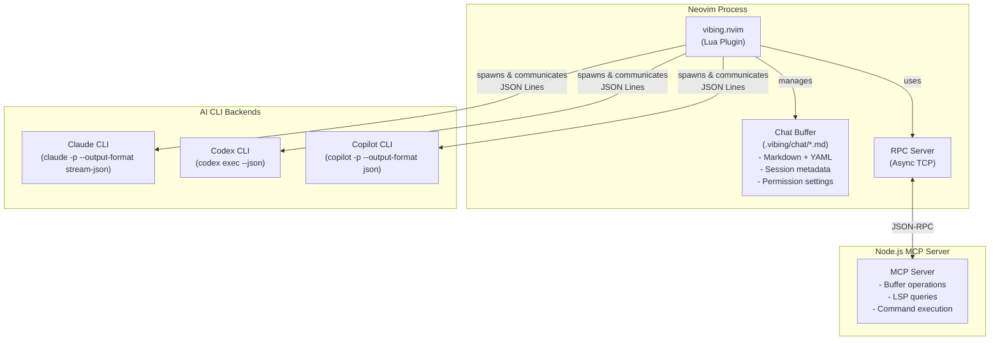

<div align="center">


# vibing.nvim

**Claude, Codex, Copilot, Grok and Pi as a Neovim buffer — with the editor handed back to them**

[](https://github.com/shabaraba/vibing.nvim/actions/workflows/ci.yml)
[](https://opensource.org/licenses/MIT)
[](https://github.com/shabaraba/vibing.nvim/releases)
[](https://neovim.io)

English | [日本語](./README.ja.md)

[Demo](#-demo) • [Features](#-features) • [Requirements](#-requirements) •
[Installation](#-installation) • [Configuration](#️-configuration) • [Usage](#-usage)

</div>

<!-- The demo clips are GitHub attachment URLs and must stay bare to render as players. -->
<!-- markdownlint-disable MD034 -->

https://github.com/user-attachments/assets/6deaaf7a-e94c-4b11-9144-011ce3a785a6

<sub>Three chats, opened in seconds, working on three different questions at once — in one
Neovim.</sub>

## ✨ Features

Unlike chat plugins that send static context to an LLM, vibing.nvim gives the AI **direct access to
your running Neovim** through CLI backends and MCP.

- 🤖 **Neovim as an agent tool** — the AI reads and writes buffers, runs Ex commands and queries
  your live LSP (diagnostics, definitions, references, symbols)
- 💬 **The chat is a Markdown buffer** — your keymaps, your motions, your search; saved under
  `.vibing/chat/`, resumable, greppable, version-controllable
- 🔀 **Multi-backend** — Claude, Codex, GitHub Copilot, Grok or Pi, switched globally or per chat
- 🧵 **Concurrent chats** — open as many as you like; start one while another is still streaming
- 🪟 **Multi-agent orchestration** — one chat creates and drives worker chats, then aggregates
  what they report back
- 🌱 **Git worktree workflow** — isolate a task in `.vibing/worktrees/<branch>/` by asking for it
- 📊 **Per-turn diffs** — every turn ends in `### Modified Files`; `gd` opens a patch viewer. The
  baseline is a git tree snapshot, so a `sed -i` through Bash is tracked like an `Edit`
- 🛡️ **Granular permissions** — allow/deny/ask per tool, path and command patterns, answered in
  the buffer without killing the turn
- ⏳ **Usage-limit scheduling** — `<CR>` parks your message instead of burning a doomed request,
  and sends it verbatim once the limit resets
- 🌍 **Per-chat response language**

### Consider alternatives if you

- Need local/offline models (Ollama, etc.)
- Prefer minimal dependencies — vibing.nvim needs Node.js for the MCP server
- Want a battle-tested plugin with a large community (we're still growing!)

vibing.nvim doesn't conflict with completion plugins (Copilot, Codeium) or other chat plugins —
they compose well.

## 🎥 Demo

Real, unedited sessions against the CLI — same plugin, same defaults, no mock-ups.

### Every turn ends in a diff you can read

A turn closes with `### Modified Files`; press `gd` on a filename and a three-pane patch viewer
opens — the tree as it was when the turn started, next to what it is now.

https://github.com/user-attachments/assets/5ab1745a-e12c-4a75-b1c6-48bdd7c14053

### Approvals are answered in the buffer, not in a popup

When a tool needs your say-so, the options are written into the chat. Delete the lines you don't
want and press `<CR>`. The hook blocks while you decide, so **the turn resumes instead of being
killed and retried** — the model keeps everything it had worked out so far.

https://github.com/user-attachments/assets/9119e216-2970-41f6-bfba-615f4585bf28

### The model can ask you a question, and wait for your answer

A choice list is rendered into your unsent section. Write your answer under it, press `<CR>`, and
it goes straight back as the tool's return value; the same turn carries on.

https://github.com/user-attachments/assets/7015c274-9d6b-4329-9a67-e9379f679b50

### One chat can create and drive others

Ask for parallel work and the chat becomes an orchestrator: a worker chat per task, each with its
own transcript you can open mid-task. `## Request` and `## Report` record who said what to whom.

https://github.com/user-attachments/assets/0d6dfa6e-8b82-49a0-b996-1c22332276cd

<sub>Played at 3× speed.</sub>

### Risky work goes into its own git worktree

"Start this in its own worktree" is all it takes: a branch under `.vibing/worktrees/<branch>/`,
and every edit, test run and commit happens in there. The checkout you are looking at never moves —
note that the file in the left window stays untouched throughout.

https://github.com/user-attachments/assets/9810e4fa-4765-4d39-bbac-2a81cd3e0a8e

### It drives your editor, instead of describing it

Ask to be walked through a code path and you get a real tour: the quickfix list holds the whole
route (walk it again with `:cnext`), each stop opens the actual file at the actual line, and the
explanation stays inline as a virtual-text annotation.

https://github.com/user-attachments/assets/8182307e-83f6-428a-af11-1122b69f4483

<sub>Played at 3× speed.</sub>

<!-- markdownlint-enable MD034 -->

## 📋 Requirements

- [Neovim](https://neovim.io) **0.10+** (uses `vim.system()`)
- [Node.js](https://nodejs.org) **18+** — for the bundled MCP server
- A C compiler — optional; without one the chat Tree-sitter parser is skipped and the previous
  whole-buffer Markdown parser is used
- At least one AI CLI backend:

| Backend            | Install                                                   |
| ------------------ | --------------------------------------------------------- |
| Claude CLI         | `npm install -g @anthropic-ai/claude-code`                |
| Codex CLI          | `npm install -g @openai/codex` (**0.140+**)               |
| GitHub Copilot CLI | `npm install -g @github/copilot` (needs Node.js 22+)      |
| Grok Build CLI     | [xAI's install docs](https://github.com/xai-org/grok-cli) |
| Pi coding agent    | `curl -fsSL https://pi.dev/install.sh | sh` (Node.js 22.19+) |

<details>
<summary><b>Codex version note</b></summary>

vibing.nvim runs the Codex backend's lightweight calls (chat title generation, `/summarize`, daily
summary) with `--ignore-user-config --strict-config`, which keeps those calls out of your MCP
servers and makes them fail loudly rather than silently unfenced if Codex renames a config key.
Both flags were verified present in **0.140.0 and 0.147.0**, on `codex exec` and
`codex exec resume` alike. Older releases were not tested; if they lack the flags, ordinary chat is
unaffected but lightweight calls fail with an unknown-argument error. Upgrade Codex if you see
that.

`--ignore-user-config` also drops `model_provider`, so if your `config.toml` points Codex at a
custom or local provider, **those lightweight calls go to the default OpenAI endpoint instead**.
Ordinary chat still uses your provider. vibing.nvim warns once per Neovim session when this applies
to you, asking Codex itself (`codex doctor --json`) which provider is configured; it says nothing
if Codex cannot answer. Set `backends.codex.provider_notice = false` to turn the warning and its
probe off.

</details>

## 📦 Installation

With [lazy.nvim](https://github.com/folke/lazy.nvim):

> Pi requires Node.js 22.19+; the bundled MCP server itself requires Node.js 18+.

```lua
{
  "shabaraba/vibing.nvim",
  build = "./build.sh", -- builds the bundled chat parser and MCP server
  dependencies = {
    "stevearc/oil.nvim", -- optional: add context straight from the file browser
  },
  opts = {},
}
```

`opts` is passed to `require("vibing").setup()`. See [Configuration](#️-configuration).

<details>
<summary><b>packer.nvim</b></summary>

```lua
use {
  "shabaraba/vibing.nvim",
  run = "./build.sh",
  config = function()
    require("vibing").setup()
  end,
}
```

</details>

<details>
<summary><b>The bundled Claude Code plugin (MCP + skills + subagent)</b></summary>

vibing.nvim ships a [Claude Code plugin](https://code.claude.com/docs/en/plugins) that bundles the
`vibing-nvim` MCP server together with Neovim-aware skills and a read-only navigation subagent.

**Nothing to install.** The plugin is not registered into Claude Code's global state at all —
vibing.nvim hands the CLI its own `claude-plugin/` directory per session with `--plugin-dir`, so
whichever checkout is running is the one that serves you. `build.sh` builds the MCP server and the
small Tree-sitter parser used for chat boundaries (and, once, cleans up an install from an older
version of vibing.nvim).

That gives you `mcp__plugin_vibing-nvim_vibing-nvim__*` tools (buffer/window/cursor access, Ex
commands, and LSP queries against the running Neovim instance), the bundled skills
(`nvim-context`, `nvim-lsp-navigation`, `vibing-chat-recall`, `vibing-chat-search`, and the
`vibing-worktree-{list,create,attach,run,finish}` worktree workflow), and the `nvim-navigator`
subagent (read-only code navigation via `@vibing-nvim:nvim-navigator`).

You still need Neovim running with `mcp = { enabled = true }` (the default) for the MCP tools to
have anything to connect to. The one trade-off is that a plain `claude` session started outside
Neovim no longer sees these tools; that was never a supported way to use them.

The Codex backend gets the same plugins without a `--plugin-dir` of its own: the MCP server is
registered per run as `-c mcp_servers.vibing-nvim.*` (tools named `mcp__vibing-nvim__*`) and the
skills are listed for the model in `developer_instructions`. Subagents do not carry over.

**Your own project plugins.** Anything you drop into `.vibing/plugins/<name>/` (with a
`.claude-plugin/plugin.json`) is loaded the same way, for chats in that project only. Run
`:VibingReloadCommands` after adding one, or `:VibingCreatePlugin <name>` to write a working
skeleton in the first place. Note that a plugin may declare `mcpServers`, so a plugin in a
repository you cloned can start a process on your machine — set `agent.plugins.project_dir = false`
for repositories you do not trust. See
[handbook/configuration.md](handbook/configuration.md) for `agent.plugins`.

**Upgrading from an older vibing.nvim:** `build.sh` removes the user-scope install and its
marketplace entry for you. To do it by hand:

```text
/plugin uninstall vibing-nvim@vibing
/plugin marketplace remove vibing
```

</details>

## 🚀 Quick Start

```vim
:VibingChat
```

Type your message under the `## User` header and press `<CR>` in normal mode to send. The AI
responds in the same buffer; `<C-c>` cancels a running request. Chats stay ordinary Markdown files
you can save, search and edit normally — a small `vibing` Tree-sitter parser isolates chat headers
and tool output and injects the standard Markdown parser into each message body, so fenced code
keeps its highlighting.

## ⚙️ Configuration

`require("vibing").setup()` works out of the box. Commonly tweaked options:

```lua
require("vibing").setup({
  adapter = "claude",              -- "claude" | "codex" | "copilot" | "grok"
  chat = {
    window = {
      position = "current",        -- "current" | "right" | "left" | "top" | "bottom" | "back" | "float"
      width = 0.4,                 -- screen-width ratio (0-1)
    },
    save_location_type = "project", -- "project" | "user" | "custom"
  },
  agent = {
    default_model = "sonnet",      -- backend model id, e.g. "sonnet" or "gpt-5.6-terra"
    default_effort = "default",     -- "default" | "low" | "medium" | "high" | "xhigh" | "max"
    scheduled_requests = {
      enabled = true,              -- during a usage limit, <CR> schedules instead of sending
    },
  },
  permissions = {
    mode = "acceptEdits",          -- "default" | "acceptEdits" | "plan" | "auto" | "dontAsk" | "bypassPermissions"
    allow = { "Read", "Edit", "Write", "Glob", "Grep", "Skill", "StructuredOutput" },
    deny = { "Bash" },
  },
  backends = {
    codex = {
      profile_file = ".vibing/codex-permissions.toml", -- false disables loading the generated profile
      -- profile_content = [[...]], -- initial TOML used only when creating the profile
      allow_tracked_profile = false, -- true explicitly trusts a Git-tracked profile
    },
    grok = { executable = "auto" }, -- or a path to the official Grok Build CLI
  },
  language = nil,                  -- e.g. "ja", or { default = "ja", chat = "ja" }
})
```

The permissions above are a **template** for new chat files; each chat's frontmatter carries its
own permissions, and those are what is enforced at runtime.

**Full reference:** every option (window details, UI/gradient/tool markers, diff backends, granular
permission rules, MCP, Node.js executable, daily summary, …) is documented in
[handbook/configuration.md](./handbook/configuration.md).

<details>
<summary><b>Project-local Codex permission profiles</b></summary>

For the Codex backend, vibing.nvim creates `.vibing/codex-permissions.toml` when it initializes a
project. Its default profile permits workspace and Git metadata writes without using full bypass
mode; edit the file to narrow or extend the OS sandbox. Existing files are never overwritten.
Git-tracked profiles are rejected unless `backends.codex.allow_tracked_profile = true` explicitly
trusts the reviewed file; locally generated, untracked profiles continue to load automatically. See
[Project-local Codex permission profiles](./handbook/configuration.md#project-local-codex-permission-profiles).

</details>

## 🚀 Usage

Also available offline as `:help vibing-commands`, which carries per-command help tags.

### Commands

| Command                                      | Description                                                                                                                                                                            |
| -------------------------------------------- | -------------------------------------------------------------------------------------------------------------------------------------------------------------------------------------- |
| `:VibingChat [position\|file]`               | Create new chat with optional position (current\|right\|left\|top\|bottom\|back) or open saved file                                                                                    |
| `:VibingToggleChat`                          | Toggle existing chat window (preserve current conversation)                                                                                                                            |
| `:VibingChatFork [position]`                 | Fork current chat (create branch from current conversation)                                                                                                                            |
| `:VibingChatHandoff [position]`              | Summarize this chat and start a new one whose first message carries the summary (cheap continuation of a long chat)                                                                    |
| `:VibingChatJumpNextUser [count]`            | Move the cursor to the next User section in the chat buffer                                                                                                                            |
| `:VibingChatJumpPrevUser [count]`            | Move the cursor to the previous User section in the chat buffer                                                                                                                        |
| `:VibingSlashCommands`                       | Show slash command picker in chat                                                                                                                                                      |
| `:VibingSetFileTitle [--linked]`             | Generate AI title and rename chat file (uses an existing `## summary` if present; `--linked` also renames linked chats)                                                                |
| `:VibingSummarize [--with-title] [--linked]` | Generate AI summary of chat history and insert into buffer (`--with-title` then renames the file from that summary; `--linked` does the same to every chat linked through frontmatter) |
| `:VibingDeleteChats [--unrenamed]`           | Delete chat files (use --unrenamed to delete all unrenamed files)                                                                                                                      |
| `:VibingContext [path]`                      | Add context: oil.nvim entry, visual selection (range), path argument, or current buffer when no args                                                                                   |
| `:VibingClearContext`                        | Clear all context                                                                                                                                                                      |
| `:VibingCancel`                              | Cancel current request                                                                                                                                                                 |
| `:VibingSchedule [when]`                     | Schedule this chat's unsent message (default: the recorded limit reset; or `30m`, `18:30`, …)                                                                                          |
| `:VibingPendingResumes`                      | List chats waiting on a usage limit reset or a scheduled send                                                                                                                          |
| `:VibingCancelResume [all]`                  | Cancel the pending auto-resume/scheduled send for this chat (or every one with `all`); also clears the project's recorded usage limit                                                  |
| `:VibingReloadCommands`                      | Reload custom slash commands and completion candidates                                                                                                                                 |
| `:VibingCreatePlugin [name]`                 | Create a project-local Claude Code plugin under `.vibing/plugins/`                                                                                                                     |
| `:VibingCopyUnsentUserHeader`                | Copy `## User <!-- unsent -->` to clipboard                                                                                                                                            |
| `:VibingDailySummary [YYYY-MM-DD]`           | Generate daily summary from project chat files (default: today)                                                                                                                        |
| `:VibingDailySummaryAll [YYYY-MM-DD]`        | Generate daily summary from all chat files (default: today)                                                                                                                            |

- **`:VibingChat`** always creates a fresh chat. Pass a position
  (`current` / `right` / `left` / `top` / `bottom` / `back`) or a saved chat file path to reopen it.
- **`:VibingChatFork`** branches the current conversation in a different direction.
- **`:VibingChatHandoff`** continues a long conversation in a fresh chat: the current one is
  summarized and the new chat's first message starts with that summary. Unlike a fork it does not
  carry the history, so every later request reads a few thousand tokens instead of the whole
  transcript. An existing `## summary` section is reused as-is; run `/summarize` first if it is out
  of date.
- **Worktree lifecycle** is handled by the bundled
  `vibing-worktree-{list,create,attach,run,finish}` skills entirely through natural language
  ("split this off into a worktree"), not by editor commands.

### Slash commands (in chat)

| Command                   | Description                                                                   |
| ------------------------- | ----------------------------------------------------------------------------- |
| `/context <file>`         | Add file to context                                                           |
| `/clear`                  | Clear context                                                                 |
| `/save`                   | Save current chat                                                             |
| `/summarize`              | Summarize conversation                                                        |
| `/model <model>`          | Set AI model for the current backend                                          |
| `/effort <level>`         | Set reasoning effort (low/medium/high/xhigh/max)                              |
| `/help`                   | Show available slash commands                                                 |
| `/permissions` or `/perm` | Interactive permission builder - configure tool allow/deny rules              |
| `/allow [tool]`           | Add tool to allow list (`-tool` removes), or show current list if no args     |
| `/deny [tool]`            | Add tool to deny list (`-tool` removes), or show current list if no args      |
| `/ask [tool]`             | Ask before using tool (`-tool` removes), or show current list if no args      |
| `/permission [mode]`      | Set permission mode (default/acceptEdits/bypassPermissions/plan/dontAsk/auto) |
| `/new-session`            | Reset session and start fresh                                                 |

`/allow`, `/deny` and `/ask` also accept granular patterns like `Bash(git:*)`,
`Read(src/**/*.ts)` and `WebFetch(github.com)`.

### Keymaps (in chat buffers)

All except `q` are configurable through `keymaps`.

| Key     | Description                                                              |
| ------- | ------------------------------------------------------------------------ |
| `<CR>`  | Send message (normal mode)                                               |
| `<C-c>` | Cancel current request                                                   |
| `<C-a>` | Add file to context                                                      |
| `gd`    | Show diff for file under cursor (in Modified Files section)              |
| `gf`    | Open file under cursor (Modified Files section, or any path in the chat) |
| `gx`    | Open URL on current line in browser                                      |
| `q`     | Close chat window                                                        |

## 📝 Chat File Format

<details>
<summary><b>Frontmatter and layout</b></summary>

Chats are saved as Markdown files (`.vibing/chat/chat-<timestamp>-....md` by default) with YAML
frontmatter for session resumption and configuration:

```yaml
---
vibing.nvim: true
session_id: <cli-session-id>
created_at: 2024-01-01T12:00:00
working_dir: .vibing/worktrees/feature-x # Optional: working directory (relative to git root)
agent: claude # claude | codex | copilot | grok | pi (overrides global adapter setting for this chat)
mode: code # code | plan | explore
model: sonnet # Backend model id, e.g. sonnet or gpt-5.6-terra
effort: default # CLI/model default | low | medium | high | xhigh | max
permission_mode: acceptEdits # default | acceptEdits | bypassPermissions | plan | dontAsk | auto
permissions_allow:
  - Read
  - Edit
  - Write
  - Glob
  - Grep
permissions_deny:
  - Bash
permissions_ask: []
language: ja # Optional: default language for AI responses
---
# Vibing Chat

## User

Hello, Claude!

## Assistant

Hello! How can I help you today?
```

- **Session resumption** — reopening a saved chat resumes the conversation via `session_id`
- **Fork tracking** — a forked chat carries a `forked_from` field until its first response
- **Auditability** — model, mode and permissions are all visible in frontmatter
- **Language** — the optional `language` field fixes the AI's response language

</details>

## 🏗️ Architecture

<details>
<summary><b>How the pieces fit together</b></summary>

For detailed architecture documentation, see [CLAUDE.md](./CLAUDE.md).


```mermaid
graph TB
    subgraph Neovim["Neovim Process"]
        Plugin["vibing.nvim<br/>(Lua Plugin)"]
        Buffer["Chat Buffer<br/>(.vibing/chat/*.md)<br/>- Markdown + YAML<br/>- Session metadata<br/>- Permission settings"]
        RPC["RPC Server<br/>(Async TCP)"]

        Plugin -->|manages| Buffer
        Plugin -->|uses| RPC
    end

    subgraph MCP["Node.js MCP Server"]
        MCPServer["MCP Server<br/>- Buffer operations<br/>- LSP queries<br/>- Command execution"]
    end

    subgraph AI["AI CLI Backends"]
        Claude["Claude CLI<br/>(claude -p --output-format stream-json)"]
        Codex["Codex CLI<br/>(codex exec --json)"]
        Copilot["Copilot CLI<br/>(copilot -p --output-format json)"]
    end

    RPC <-->|JSON-RPC| MCPServer
    Plugin -->|spawns & communicates<br/>JSON Lines| Claude
    Plugin -->|spawns & communicates<br/>JSON Lines| Codex
    Plugin -->|spawns & communicates<br/>JSON Lines| Copilot
```

| Aspect         | Traditional REST API | vibing.nvim (CLI Adapters)    |
| -------------- | -------------------- | ----------------------------- |
| Context        | Manually assembled   | MCP: agent requests on-demand |
| Editor Access  | None (fire & forget) | Full bidirectional MCP        |
| Session State  | Plugin manages       | CLI session with resume       |
| Tool Execution | Plugin implements    | CLI native tools              |

</details>

## ❓ FAQ

<details>
<summary><b>Which AI backends are supported?</b></summary>

- **Claude CLI** (`claude -p --output-format stream-json`) — full Claude Code capabilities
- **Codex CLI** (`codex exec --json`) — OpenAI Codex backend
- **GitHub Copilot CLI** (`copilot -p --output-format json`) — GitHub Copilot backend
- **Grok Build CLI** (`grok --single --output-format streaming-json`) — xAI Grok backend
- **Pi coding agent** (`pi --mode json`) — a harness rather than a vendor CLI; it uses the provider
  selected in Pi's own configuration, including local models served through OpenAI-compatible
  endpoints

Switch globally with `adapter = "claude"|"codex"|"copilot"|"grok"|"pi"` in setup, or per-chat by adding
`agent: claude`, `agent: codex`, `agent: copilot`, `agent: grok` or `agent: pi` to a chat file's YAML
frontmatter. `effort: low|medium|high|xhigh|max` controls reasoning for Claude, Codex and Grok when
the selected model supports that level. New chats use `effort: default`, which passes no override
and therefore preserves the same CLI/model default used before effort was configurable. Omitting
the field has the same runtime behaviour for existing chats.

> **Note:** on the Copilot backend, `permissions.mode`, `permissions.ask` and the in-chat Tool
> Approval UI are enforced through a generated Copilot plugin (`.vibing/copilot-plugin/`) that
> vibing.nvim loads per run with `copilot --plugin-dir`. Your own `~/.copilot/` configuration and
> login are never touched. Copilot's static `--deny-tool` flags are still passed as a backstop;
> they cover `Bash` (including `Bash(cmd:*)` patterns), `Write`, `Edit`, `WebFetch` and
> `WebSearch`, and vibing.nvim warns once when it drops a tool name Copilot cannot express.

> **Note:** Pi has no tool approval mechanism or MCP client. The `pi-extension/` bundle applies
> vibing.nvim's permission rules; without it, Pi is restricted to read-only tools. Pi also cannot
> use the `nvim_*` tools or the in-chat question UI. Model IDs and local providers are configured
> in Pi itself; set `backends.pi.provider` to pin the provider.

</details>

<details>
<summary><b>Why does it require Node.js?</b></summary>

Node.js is required for the MCP server, which provides AI with direct access to your running Neovim
instance (buffer reads/writes, LSP queries, command execution). The AI CLI binaries themselves
(`claude`, `codex`, `copilot`) are separate installs.

</details>

<details>
<summary><b>How does it compare to the Claude Code CLI?</b></summary>

vibing.nvim provides similar capabilities to Claude Code CLI but integrated into Neovim:

- Same `claude` CLI underneath
- MCP for editor control (the CLI controls a terminal, vibing controls Neovim)
- Additional Codex, Copilot and Grok backends for non-Anthropic workflows

Think of it as "Claude Code (or Codex, or Copilot) for Neovim users."

</details>

<details>
<summary><b>Can I use vibing.nvim alongside other AI plugins?</b></summary>

Yes. vibing.nvim doesn't conflict with completion plugins (Copilot, Codeium) or other chat plugins.
Use vibing.nvim for deep interactions and other tools for quick completions or different providers.

</details>

## 🤝 Contributing

Contributions are welcome! See [CONTRIBUTING.md](./CONTRIBUTING.md), and feel free to submit issues
or pull requests.

## 📄 License

MIT — see [LICENSE](./LICENSE).

## 🔗 Links

- [Claude AI](https://claude.ai)
- [Codex CLI](https://github.com/openai/codex)
- [GitHub Copilot CLI](https://github.com/github/copilot-cli)
- [Grok CLI](https://github.com/xai-org/grok-cli)

---

<div align="center">

Made with ❤️ using Claude Code

</div>
