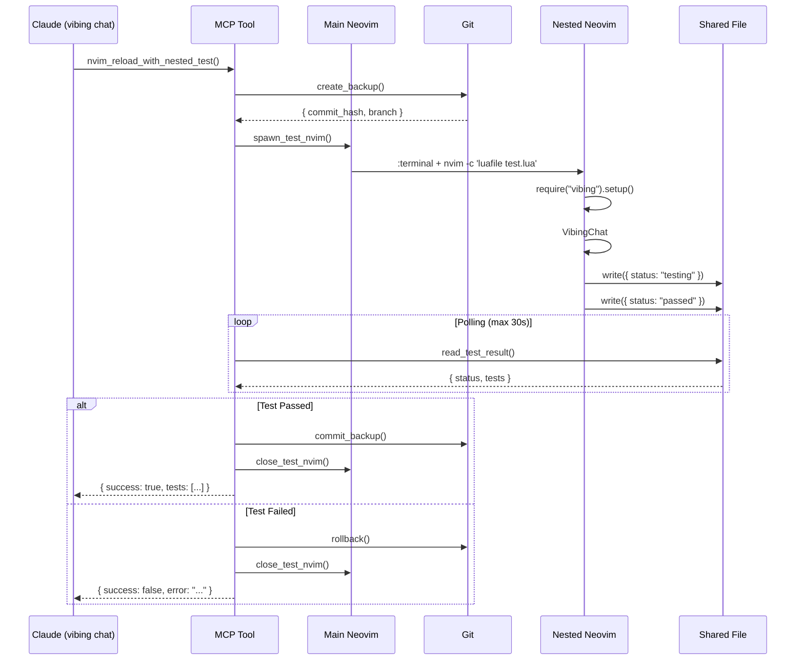

# ADR 007: Self-Development Loop with Nested Neovim Testing

## Status

Proposed

## Context

vibing.nvim の開発において、Claude が自分自身（vibing.nvim プラグイン）を修正・テスト・デバッグする「自己開発ループ」を実現したいという要求があります。

### 課題

1. **プロセス自殺問題**: vibing chat 内の Claude が MCP 経由で reload を実行すると、自分自身のプロセス（agent-wrapper.mjs）が kill され、セッションが途切れる
2. **Lua エラーの危険性**: Lua コードに構文エラーがあると、reload 時に vibing.nvim 全体が死に、復旧不可能になる
3. **Node.js エラーの検出**: agent-wrapper.mjs の変更は Lua reload だけでは反映されず、新しいプロセス起動が必要
4. **テストの自動化**: コード修正後、手動でテストするのは非効率

### 既存の制約

- vibing chat は agent-wrapper.mjs を vim.system() で起動している
- MCP RPC server は Lua 内で動作している
- 同じ Neovim プロセス内での reload は全体に影響する

## Decision

**ネストした Neovim プロセスでテストを行う安全な reload フロー**を実装します。

### アーキテクチャ

```
Main Neovim プロセス (port 9876)
  ├─ vibing chat (Claude が実行中)
  │   └─ MCP で nvim_reload_with_nested_test() 実行
  │
  └─ :terminal 起動
      └─ Nested Neovim プロセス (port 9877)
          ├─ テスト用の vibing.nvim をロード
          ├─ 基本的な動作確認を自動実行
          └─ 結果を shared file に書き込み
```

### コンポーネント設計

#### 1. Git バックアップシステム

**ファイル**: `lua/vibing/core/utils/git_helper.lua`

```lua
M.create_backup() → { commit_hash, branch_name }
M.rollback(backup_info)
M.commit_backup(backup_info)
```

- 変更を一時コミット（WIP commit）
- テスト失敗時に自動ロールバック
- テスト成功時にコミットを確定

#### 2. ネストした Neovim テストランナー

**ファイル**: `lua/vibing/dev/nested_test.lua`

```lua
M.spawn_test_nvim() → {
  term_bufnr,    -- ターミナルバッファ番号
  term_chan,     -- チャンネル ID
  test_result_file,  -- 結果ファイルパス
  test_script    -- 実行スクリプトパス
}

M.read_test_result() → {
  status = "passed|failed|testing",
  tests = [
    { name, success, message },
    ...
  ]
}

M.close_test_nvim(term_chan)
```

**動作フロー:**

1. `:terminal` を split で開く
2. テストスクリプトを生成（Lua ファイル）
3. `vim.fn.chansend()` で `nvim -c 'luafile test.lua'` を実行
4. Nested nvim が起動し、以下を実行:
   - `require("vibing").setup({ mcp = { rpc_port = 9877 } })`
   - `:VibingChat` を開く
   - 基本的な動作確認
   - 結果を JSON ファイルに書き込み
5. Main nvim が polling で結果を監視

#### 3. Shared File Protocol

**ファイルパス**: `~/.local/share/nvim/vibing_reload_test.json`

**フォーマット**:

```json
{
  "status": "testing|passed|failed",
  "timestamp": 1234567890,
  "tests": [
    {
      "name": "setup",
      "success": true,
      "message": "Setup successful"
    },
    {
      "name": "open_chat",
      "success": true,
      "message": "Chat opened"
    }
  ]
}
```

#### 4. MCP Tool

**ファイル**: `mcp-server/src/tools/reload.ts`

```typescript
server.tool(
  'nvim_reload_with_nested_test',
  'Reload vibing.nvim and test in nested Neovim',
  {
    timeout_seconds: z.number().optional().default(30),
  },
  async (args) => {
    // 1. Git backup
    // 2. Spawn nested nvim
    // 3. Poll test result
    // 4. Success → commit, Failed → rollback
    // 5. Close nested nvim
  }
);
```

#### 5. Reload エントリーポイント

**ファイル**: `lua/vibing/init.lua`

```lua
function M.reload_with_nested_test()
  -- 1. Git backup 作成
  local backup = git_helper.create_backup()

  -- 2. Nested nvim でテスト起動
  local test_info = nested_test.spawn_test_nvim()

  return {
    success = true,
    test_info = test_info,
    backup = backup,
  }
end
```

### 実行フロー



## Consequences

### Positive

1. **完全な安全性**: Nested nvim は別プロセスなので、テスト失敗しても Main nvim は無事
2. **環境非依存**: `:terminal` は Neovim 標準機能なので、追加の依存なし
3. **自動 Rollback**: Git による確実なロールバック
4. **可視性**: Terminal buffer でテストの様子を目視確認可能
5. **自動化**: MCP 経由で完全自動化可能

### Negative

1. **実装の複雑さ**: 複数のコンポーネント（Git、Terminal、Polling、Shared File）が必要
2. **Nested Neovim の制約**: Terminal 内の nvim は一部の機能（clipboard など）が制限される可能性
3. **パフォーマンス**: Nested nvim の起動に数秒かかる
4. **デバッグ**: Nested nvim 内のエラーはログが取りにくい

### Neutral

1. **UI の占有**: Terminal buffer が split で開くため、画面を占有
2. **Polling オーバーヘッド**: 1秒ごとのファイル読み込みが発生

## Alternatives Considered

### 案1: 同一プロセス内での pcall reload

**却下理由**:

- Lua エラー後の VM 状態が不安定
- Segfault など致命的なエラーはキャッチ不可
- Node.js コードの変更は反映されない

### 案2: Headless Neovim

**却下理由**:

- UI の動作確認ができない
- ユーザーが何が起きているか見えない
- デバッグが困難

### 案3: 別ターミナル起動

**却下理由**:

- 環境依存（tmux、kitty、alacritty など）
- 自動検出が複雑
- クロスプラットフォーム対応が困難

### 案4: HTTP health check

**却下理由**:

- HTTP サーバーの追加依存
- ポート管理の複雑化
- オーバーエンジニアリング

## Implementation Notes

### Phase 1: Core Components

1. `git_helper.lua` - Git バックアップ/ロールバック
2. `nested_test.lua` - Nested nvim 起動と結果読み取り
3. `M.reload_with_nested_test()` - エントリーポイント

### Phase 2: MCP Integration

4. `mcp-server/src/tools/reload.ts` - MCP tool 実装
5. Polling ロジック
6. エラーハンドリング

### Phase 3: Testing & Documentation

7. ユニットテスト
8. E2E テスト（手動）
9. ユーザードキュメント更新

### テストスクリプトの例

```lua
-- test_script.lua (Nested nvim で実行)
local result = { status = "testing", tests = {} }
local test_file = vim.fn.stdpath("data") .. "/vibing_reload_test.json"

local function report(name, success, message)
  table.insert(result.tests, {
    name = name,
    success = success,
    message = message,
  })
  vim.fn.writefile({ vim.json.encode(result) }, test_file)
end

-- Test 1: Setup
local ok, err = pcall(function()
  require("vibing").setup({ mcp = { enabled = true, rpc_port = 9877 } })
end)
report("setup", ok, ok and "Setup OK" or tostring(err))

if not ok then
  result.status = "failed"
  vim.fn.writefile({ vim.json.encode(result) }, test_file)
  vim.cmd("qall!")
  return
end

-- Test 2: Open chat
vim.schedule(function()
  local ok2, err2 = pcall(function()
    vim.cmd("VibingChat")
  end)
  report("open_chat", ok2, ok2 and "Chat opened" or tostring(err2))

  result.status = ok2 and "passed" or "failed"
  vim.fn.writefile({ vim.json.encode(result) }, test_file)
end)
```

### エラーハンドリング

1. **Nested nvim が起動しない**: Timeout で検出、rollback
2. **Setup が失敗**: Test result に記録、rollback
3. **Polling timeout**: Main nvim に警告、手動確認を促す
4. **Git 操作失敗**: エラー通知、手動復旧を指示

### セキュリティ考慮事項

- テストスクリプトは一時ファイル（tempname）に保存
- Shared file は `stdpath("data")` 配下（ユーザー専用）
- Git 操作は現在のリポジトリ内に限定

## References

- ADR 002: Concurrent Execution Support
- ADR 004: Multi-Instance Neovim Support
- [Nested Neovim Feasibility Research](../specs/nested-nvim-research.md) - ネストした Neovim の動作検証と調査結果
- Neovim `:help terminal`
- Neovim `:help vim.fn.chansend()`

## Date

2025-01-11
